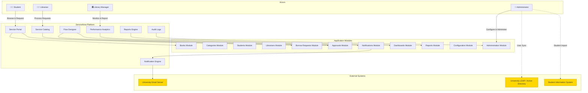
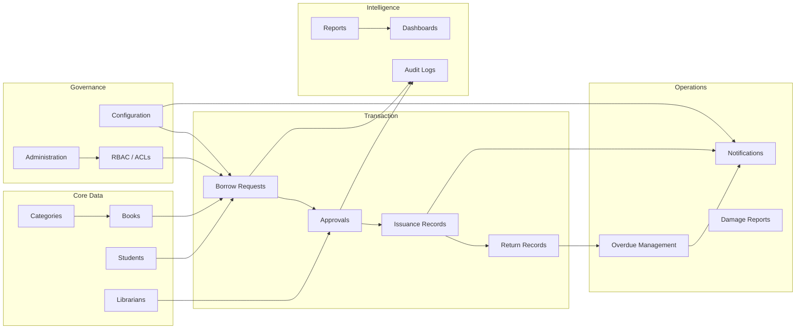
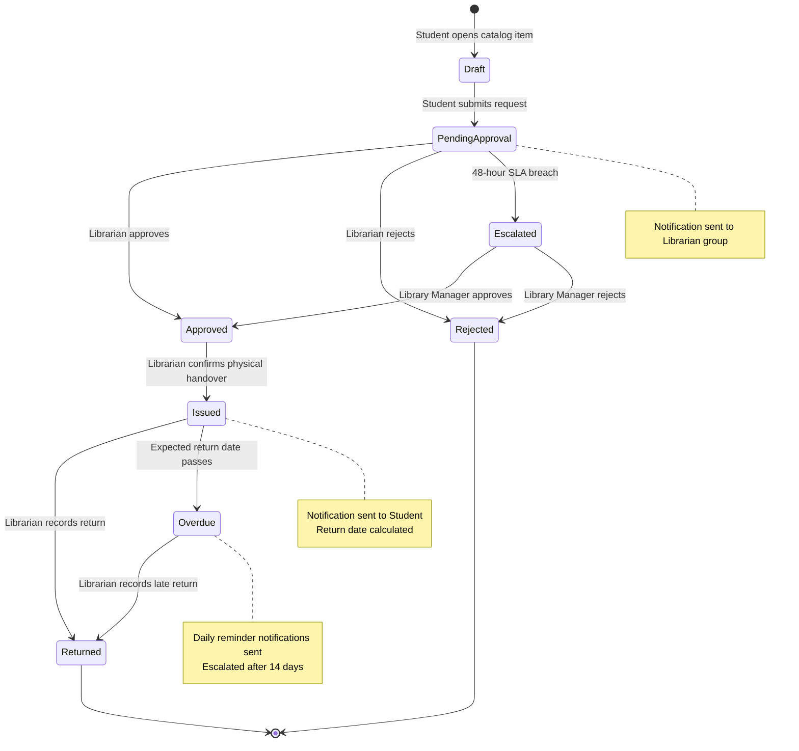
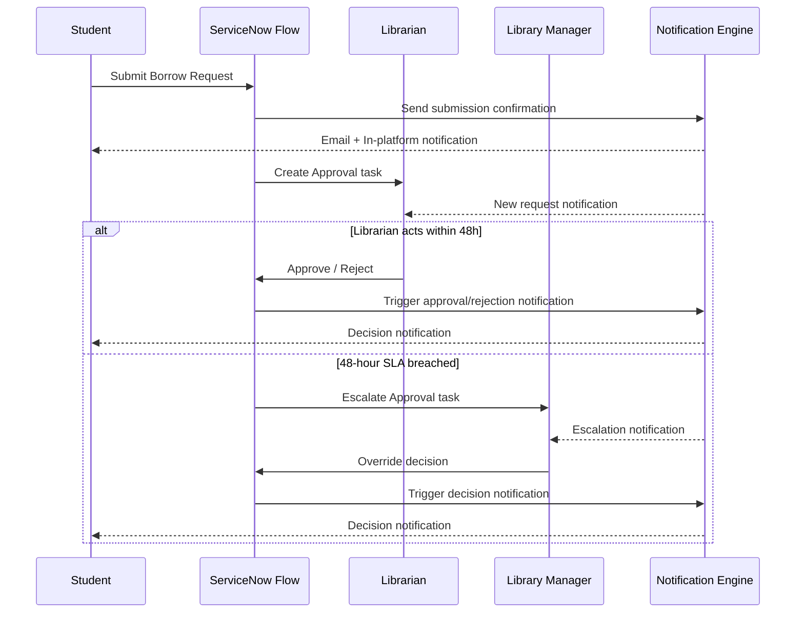
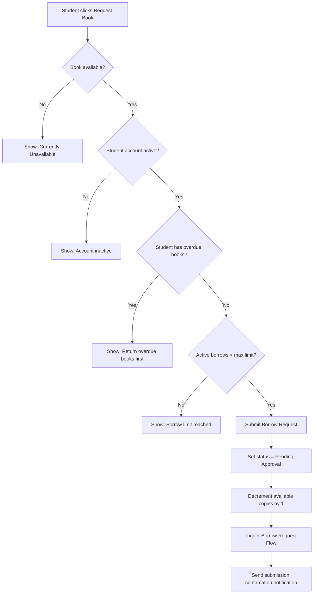
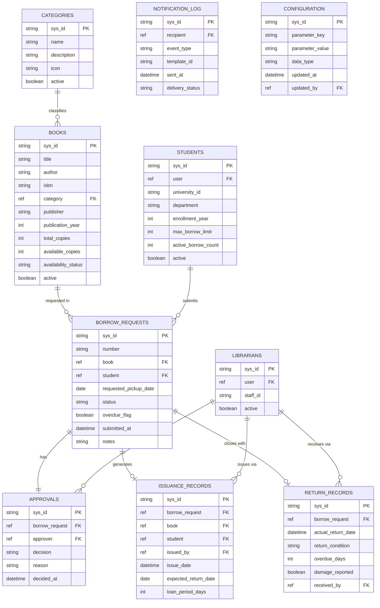

# Requirements Document
# Smart Library Request Workflow — ServiceNow Enterprise Solution

> **Project:** Smart Library Request Workflow
> **Platform:** ServiceNow (Washington DC or later)
> **Document Type:** Requirements Specification
> **Status:** Final — Implemented

---

## Table of Contents

1. [Introduction](#1-introduction)
2. [Glossary](#2-glossary)
3. [Stakeholders & Roles](#3-stakeholders--roles)
4. [System Context Diagram](#4-system-context-diagram)
5. [Module Overview](#5-module-overview)
6. [Workflow Overview](#6-workflow-overview)
7. [Functional Requirements](#7-functional-requirements)
   - [FR-01: Book Catalog Management](#fr-01-book-catalog-management)
   - [FR-02: Category Management](#fr-02-category-management)
   - [FR-03: Student Profile Management](#fr-03-student-profile-management)
   - [FR-04: Librarian Profile Management](#fr-04-librarian-profile-management)
   - [FR-05: Borrow Request Submission](#fr-05-borrow-request-submission)
   - [FR-06: Approval Workflow](#fr-06-approval-workflow)
   - [FR-07: Book Issuance](#fr-07-book-issuance)
   - [FR-08: Book Return Processing](#fr-08-book-return-processing)
   - [FR-09: Overdue Book Management](#fr-09-overdue-book-management)
   - [FR-10: Notification System](#fr-10-notification-system)
   - [FR-11: Reports and Analytics](#fr-11-reports-and-analytics)
   - [FR-12: Dashboards](#fr-12-dashboards)
   - [FR-13: Role-Based Access Control](#fr-13-role-based-access-control)
   - [FR-14: Audit Logging](#fr-14-audit-logging)
   - [FR-15: Service Portal Interface](#fr-15-service-portal-interface)
   - [FR-16: Configuration Management](#fr-16-configuration-management)
   - [FR-17: Administration Module](#fr-17-administration-module)
8. [Non-Functional Requirements](#8-non-functional-requirements)
   - [NFR-01: Performance](#nfr-01-performance)
   - [NFR-02: Availability & Reliability](#nfr-02-availability--reliability)
   - [NFR-03: Security](#nfr-03-security)
   - [NFR-04: Scalability](#nfr-04-scalability)
   - [NFR-05: Maintainability](#nfr-05-maintainability)
   - [NFR-06: Usability & Accessibility](#nfr-06-usability--accessibility)
   - [NFR-07: Compliance & Data Governance](#nfr-07-compliance--data-governance)
9. [Data Model Overview](#9-data-model-overview)
10. [Integration Points](#10-integration-points)
11. [Out of Scope](#11-out-of-scope)
12. [Assumptions & Constraints](#12-assumptions--constraints)

---

## 1. Introduction

The **Smart Library Request Workflow** is an enterprise ServiceNow solution designed for a university library. It automates the complete book borrowing lifecycle — from student browsing and requesting books, through librarian approval, to physical issuance, return, and management reporting. The system replaces manual, paper-based processes with a centralized, role-based digital workflow built on ServiceNow platform best practices.

### 1.1 Business Problem

University libraries managing thousands of books and hundreds of concurrent student borrowers face significant operational challenges with manual processes:

- No centralized visibility into real-time book availability
- Approval decisions made via email with no audit trail
- No automated overdue tracking or reminder system
- Reporting requires manual spreadsheet compilation
- Inconsistent enforcement of borrowing limits and policies

### 1.2 Solution Summary

This ServiceNow application provides a unified platform covering all 11 operational modules:

| Module | Scope |
|--------|-------|
| **Books** | Catalog management, availability tracking |
| **Categories** | Book classification and browsing |
| **Students** | Student profile, borrowing history, limits |
| **Librarians** | Staff profiles, workload management |
| **Borrow Requests** | Request submission, status tracking |
| **Approvals** | Structured approval with escalation |
| **Notifications** | Automated multi-channel alerts |
| **Reports** | Scheduled and on-demand analytics |
| **Dashboards** | Real-time operational visibility |
| **Administration** | System administration and user management |
| **Configuration** | Centralized parameter control |

### 1.3 Document Scope

This document defines all business requirements, functional requirements, non-functional requirements, user stories, and acceptance criteria for the complete ServiceNow implementation. All requirements were implemented in the `x_univ_library` scoped application on ServiceNow Washington DC.

---

## 2. Glossary

| Term | Definition |
|------|-----------|
| **System** | The Smart Library Request Workflow application running on the ServiceNow platform |
| **Student** | A registered university member with the `student_library` role who can browse and request books |
| **Librarian** | A university staff member with the `librarian_library` role who manages book inventory and processes borrow requests |
| **Library_Manager** | A senior staff member with the `library_manager` role who oversees operations, approves escalations, and reviews reports |
| **Administrator** | A system administrator with the `library_admin` role, having full access to configure and maintain the application |
| **Book** | A physical inventory item tracked in the Books table with metadata such as title, author, ISBN, category, and availability status |
| **Category** | A classification group (e.g., Science, History, Fiction) used to organize books |
| **Borrow_Request** | A formal ServiceNow record created when a Student requests to borrow a Book |
| **Approval** | A workflow task assigned to a Librarian or Library_Manager to accept or reject a Borrow_Request |
| **Notification** | An automated ServiceNow email or in-platform alert triggered by workflow events |
| **Dashboard** | A ServiceNow Performance Analytics dashboard displaying real-time library metrics |
| **Report** | A scheduled or on-demand ServiceNow report summarizing library activity |
| **Flow** | A ServiceNow Flow Designer automation orchestrating the borrow request lifecycle |
| **Catalog_Item** | A ServiceNow Service Catalog entry through which Students submit Borrow_Requests |
| **Portal** | The ServiceNow Service Portal interface used by Students to browse and request books |
| **ACL** | Access Control List — a ServiceNow security rule restricting record-level access by role |
| **Business_Rule** | A server-side ServiceNow script that enforces data integrity before or after database operations |
| **UI_Policy** | A ServiceNow client-side rule that controls field visibility, mandatory status, or read-only state based on form conditions |
| **Script_Include** | A reusable server-side JavaScript library callable from Business Rules, Flows, and other scripts |
| **SLA** | Service Level Agreement — a defined time target for completing an action |
| **Instance** | A ServiceNow environment used during development and deployment |
| **WCAG** | Web Content Accessibility Guidelines — international standard for web accessibility |

---

## 3. Stakeholders & Roles

### 3.1 Role Summary Table

| Role | System Name | Description | Key Permissions |
|------|-------------|-------------|-----------------|
| **Student** | `student_library` | University student with a registered profile | Browse books, submit/cancel own requests, view own history |
| **Librarian** | `librarian_library` | Library staff managing day-to-day operations | Manage book catalog, process approvals, issue/receive books |
| **Library Manager** | `library_manager` | Senior library staff overseeing all operations | All Librarian permissions + reports, dashboards, escalation management, category admin |
| **Administrator** | `library_admin` | IT/system administrator | Full CRUD on all tables, user management, configuration, audit access |

### 3.2 Role Hierarchy

```
library_admin
    └── library_manager
            └── librarian_library
                        └── student_library
```

> **Note:** Inheritance is logical (scope of access widens upward) but must be implemented as discrete ACL rules — not actual role inheritance — to prevent unintended privilege escalation. 

---

## 4. System Context Diagram



> **Legend:** Yellow nodes are external integration points connected via SMTP, LDAP, and REST

---

## 5. Module Overview



---

## 6. Workflow Overview

### 6.1 Borrow Request Lifecycle



### 6.2 Approval Escalation Flow



---

## 7. Functional Requirements

### FR-01: Book Catalog Management

**User Story:** As a Librarian, I want to manage the book catalog, so that Students can browse an accurate and up-to-date list of available books.

#### FR-01 Book Data Model

| Field | Type | Description |
|-------|------|-------------|
| `title` | String (255) | Book title — required |
| `author` | String (255) | Primary author name — required |
| `isbn` | String (20) | International Standard Book Number — unique, required |
| `category` | Reference (Categories) | Book classification category |
| `publisher` | String (255) | Publisher name |
| `publication_year` | Integer | Year of publication |
| `edition` | String (50) | Edition (e.g., "3rd") |
| `total_copies` | Integer | Total physical copies owned |
| `available_copies` | Integer | Copies currently available for borrowing |
| `location` | String (100) | Shelf/aisle location in library |
| `description` | Text | Summary or synopsis |
| `cover_image_url` | URL | External URL for book cover image |
| `availability_status` | Choice (Available / Unavailable) | System-maintained availability flag |
| `active` | Boolean | Whether the record is active |

> Create the `u_library_books` table with the above schema in the application scope.

#### Acceptance Criteria

1. THE System SHALL provide a Books table storing each Book's title (max 255 chars), author (max 255 chars), ISBN (max 20 chars), category, publisher (max 255 chars), publication year (1000–current year), edition (max 50 chars), total copies (0–9999), available copies (0–9999), location (max 100 chars), description (max 2000 chars), cover image URL (max 500 chars), and active status.
2. THE System SHALL enforce that ISBN values in the Books table are unique across all records, rejecting any create or update operation that would produce a duplicate ISBN with the message: "A book with this ISBN already exists."
3. WHEN a Librarian creates a new Book record, THE System SHALL set the available copies equal to the total copies by default.
4. WHEN a Librarian updates the total copies field of a Book record to a value lower than the current borrowed copies count, THE System SHALL reject the update and display the message: "Total copies cannot be less than currently borrowed copies."
5. WHEN a Book's available copies count transitions from a value greater than zero to zero, THE System SHALL set the Book's availability status to "Unavailable" automatically.
6. WHEN a Book's available copies count increases above zero from zero, THE System SHALL set the Book's availability status to "Available" automatically.
7. THE System SHALL allow Librarians and Library_Managers to create, read, update, and deactivate (set active = false) Book records. Deactivated books SHALL be excluded from Student search and browse results on the Portal.
8. THE System SHALL restrict Students to read-only access on Book records.
9. IF a Librarian attempts to deactivate a Book record that has one or more active Borrow_Requests with status "Pending Approval", "Approved", or "Issued", THEN THE System SHALL reject the deactivation and display the message: "Cannot deactivate this book. [count] active borrow request(s) exist."
10. THE System SHALL provide a Category reference field on each Book record linked to the Categories table.
11. WHERE full-text search is enabled on the Portal, THE System SHALL allow Students to search Books by title, author, ISBN, or category name using case-insensitive partial matching, returning only active Book records in the results.

---

### FR-02: Category Management

**User Story:** As a Library_Manager, I want to manage book categories, so that books are logically organized and easy to browse.

#### FR-02 Category Data Model

| Field | Type | Description |
|-------|------|-------------|
| `name` | String (100) | Category name — unique, required |
| `description` | Text | Category description |
| `icon` | String (50) | Icon identifier for portal display |
| `active` | Boolean | Whether the category is currently active |

> Create the `u_library_categories` table in the application scope.

#### Acceptance Criteria

1. THE System SHALL provide a Categories table storing each category's name, description, icon, and active status.
2. THE System SHALL enforce that category names are unique across all active Category records.
3. WHEN a Library_Manager deactivates a Category, THE System SHALL display a warning if Books are currently associated with that category, listing the count of affected Books.
4. IF a Category is deactivated, THEN THE System SHALL prevent new Book records from referencing that deactivated Category.
5. THE System SHALL allow Library_Managers and Administrators to create, read, update, and deactivate Category records.
6. THE System SHALL restrict Students and Librarians to read-only access on Category records.

---

### FR-03: Student Profile Management

**User Story:** As an Administrator, I want to manage student profiles, so that only authorized university members can borrow books.

#### FR-03 Student Profile Data Model

| Field | Type | Description |
|-------|------|-------------|
| `user` | Reference (sys_user) | ServiceNow user record — required |
| `university_id` | String (50) | University-issued student ID — unique, required |
| `department` | String (100) | Academic department |
| `enrollment_year` | Integer | Year of enrollment |
| `max_borrow_limit` | Integer (1–20) | Maximum books allowed concurrently, default 5 |
| `active_borrow_count` | Integer | System-maintained count of currently issued books |
| `active` | Boolean | Whether the student account is active |

> Create the `u_library_students` table extending `sys_user` in the application scope.

#### Acceptance Criteria

1. THE System SHALL provide a Students table extending the ServiceNow `sys_user` table, storing each student's university ID, department, enrollment year, active status, and maximum borrow limit.
2. THE System SHALL enforce that university IDs are unique across all Student records.
3. WHEN a new user is assigned the `student_library` role, THE System SHALL automatically create a corresponding Student profile record with a default maximum borrow limit of five books.
4. THE System SHALL allow Administrators to set each Student's maximum borrow limit to a value between one and twenty.
5. IF a Student's account is deactivated, THEN THE System SHALL prevent the Student from submitting new Borrow_Requests.
6. WHILE a Student has one or more overdue Borrow_Requests, THE System SHALL prevent the Student from submitting additional Borrow_Requests.
7. THE System SHALL allow Administrators to view the complete borrowing history for any Student.

---

### FR-04: Librarian Profile Management

**User Story:** As an Administrator, I want to manage librarian profiles, so that only authorized staff can approve requests and manage inventory.

#### FR-04 Librarian Profile Data Model

| Field | Type | Description |
|-------|------|-------------|
| `user` | Reference (sys_user) | ServiceNow user record — required |
| `staff_id` | String (50) | University staff ID — unique, required |
| `department_assignments` | List (Categories) | Categories this librarian manages |
| `active` | Boolean | Whether the librarian account is active |

> Create the `u_library_librarians` table extending `sys_user` in the application scope.

#### Acceptance Criteria

1. THE System SHALL provide a Librarians table extending the ServiceNow `sys_user` table, storing each librarian's staff ID, department assignment, and active status.
2. THE System SHALL enforce that staff IDs are unique across all Librarian records.
3. WHEN a new user is assigned the `librarian_library` role, THE System SHALL automatically create a corresponding Librarian profile record.
4. THE System SHALL allow Administrators to assign Librarians to one or more department categories for approval routing purposes.
5. IF a Librarian's account is deactivated, THEN THE System SHALL reassign all pending Approvals from that Librarian to the `library_manager` role group.

---

### FR-05: Borrow Request Submission

**User Story:** As a Student, I want to submit a borrow request for a book, so that I can obtain the book through a structured approval process.

#### FR-05 Borrow Request Data Model

| Field | Type | Description |
|-------|------|-------------|
| `number` | String (20) | Auto-generated request number with prefix "LIB-" |
| `book` | Reference (Books) | The requested book — required |
| `student` | Reference (Students) | The requesting student — required |
| `requested_pickup_date` | Date | Student's preferred pickup date |
| `notes` | Text | Optional student notes |
| `status` | Choice | Pending Approval / Approved / Rejected / Issued / Returned / Overdue / Cancelled |
| `overdue_flag` | Boolean | System-set flag when return date passes |
| `submitted_at` | DateTime | Timestamp of submission |
| `opened_by` | Reference (sys_user) | Submitting user |

> Create the `u_library_borrow_requests` table in the application scope. Configure the Catalog Item and associated variables in Service Catalog.

#### FR-05 Submission Validation Flow



#### Acceptance Criteria

1. THE System SHALL provide a Catalog_Item through which Students submit Borrow_Requests.
2. WHEN a Student submits a Borrow_Request, THE System SHALL capture the requested Book, the requesting Student's profile, a requested pickup date between 1 and 30 calendar days from submission, and any notes (max 500 characters).
3. WHEN a Student submits a Borrow_Request, THE System SHALL automatically set the request status to "Pending Approval" and generate a unique request number with the prefix "LIB-" followed by a zero-padded 8-digit sequential integer (e.g., LIB-00000001).
4. IF a Student submits a Borrow_Request for a Book with zero available copies, THEN THE System SHALL reject the submission and display the message: "This book is currently unavailable. Please check back later."
5. IF a Student submits a Borrow_Request that would cause the Student's active borrow count to exceed the Student's maximum borrow limit, THEN THE System SHALL reject the submission and display the message: "You have reached your maximum borrow limit of [limit] books."
6. WHILE a Student has one or more Borrow_Requests whose expected return date has passed and whose status is not "Returned", THE System SHALL reject any new Borrow_Request submissions from that Student and display the message: "You have overdue books. Please return them before requesting new books."
7. WHEN a Borrow_Request is created, THE System SHALL decrement the associated Book's available copies by one.
8. THE System SHALL allow Students to view only their own Borrow_Request records (records where `opened_by` equals the authenticated user's `sys_id`).
9. THE System SHALL allow Librarians and Library_Managers to view all Borrow_Request records.
10. WHEN a Student submits a Borrow_Request, THE System SHALL trigger the Borrow Request Flow in Flow Designer.
11. IF a Student already has an active Borrow_Request with status "Pending Approval" or "Approved" for the same Book, THEN THE System SHALL reject the new submission and display the message: "You already have an active request for this book."

---

### FR-06: Approval Workflow

**User Story:** As a Librarian, I want to review and approve or reject borrow requests, so that book loans are controlled and authorized.

#### FR-06 Approval SLA Table

| Condition | Action | SLA |
|-----------|--------|-----|
| New Borrow_Request arrives | Approval task created and assigned to Librarian group | Immediate (Flow trigger) |
| Approval task unactioned | Escalate to Library_Manager group | 48 hours |
| Escalated approval unactioned | Create follow-up task for Administrator | 72 hours |

> Configure SLA definitions and escalation rules in Flow Designer. Set up the Librarian approval group.

#### Acceptance Criteria

1. WHEN a Borrow_Request reaches "Pending Approval" status, THE System SHALL create an Approval task and assign it to the `librarian_library` group.
2. WHEN a Librarian approves a Borrow_Request, THE System SHALL set the request status to "Approved" and record the approving Librarian's name, approval timestamp, and any approval notes.
3. WHEN a Librarian rejects a Borrow_Request, THE System SHALL require the Librarian to supply a non-empty rejection reason (max 500 characters), set the request status to "Rejected", record the rejection reason and Librarian identity, and increment the associated Book's available copies by one.
4. IF an Approval task remains unactioned for forty-eight hours, THEN THE System SHALL set the Borrow_Request status to "Escalated", reassign the Approval task to the `library_manager` role group, and send a Notification to the Library_Manager.
5. WHEN a Borrow_Request is approved, THE System SHALL trigger the book issuance step in the Borrow Request Flow.
6. THE System SHALL record for each Approval action: the approver's identity, the timestamp of the decision, the decision outcome (Approved / Rejected / Escalated), and the rationale supplied by the approver.
7. WHEN a Library_Manager overrides an Approval decision on a Borrow_Request, THE System SHALL record the override as a new Approval action with the Library_Manager's identity, timestamp, new decision, and override reason, and update the Borrow_Request status accordingly.
8. IF an Escalated Approval task remains unactioned by the Library_Manager group for seventy-two hours from the escalation timestamp, THEN THE System SHALL create a follow-up task assigned to the `library_admin` group and send a Notification to the `library_admin` group.

---

### FR-07: Book Issuance

**User Story:** As a Librarian, I want to issue approved books to students, so that physical handover is tracked in the system.

#### FR-07 Issuance Record Data Model

| Field | Type | Description |
|-------|------|-------------|
| `borrow_request` | Reference (Borrow_Requests) | Parent request record |
| `book` | Reference (Books) | The book being issued |
| `student` | Reference (Students) | Recipient student |
| `issued_by` | Reference (Librarians) | Librarian performing issuance |
| `issue_date` | DateTime | Actual date and time of physical handover |
| `expected_return_date` | Date | Calculated return deadline |
| `loan_period_days` | Integer | Loan period applied (default or category-specific) |

> Create `u_library_issuance_records` table. Implement loan period logic in a Script_Include.

#### Acceptance Criteria

1. WHEN a Borrow_Request status is set to "Approved", THE System SHALL generate an issuance record containing the Book, Student, issue date, expected return date, and Librarian who performed the issuance.
2. THE System SHALL calculate the expected return date as the issue date plus the configured loan period in days, defaulting to fourteen days.
3. WHEN a Librarian confirms physical book handover, THE System SHALL set the Borrow_Request status to "Issued" and record the actual issue date and time.
4. WHERE the loan period configuration is set per category, THE System SHALL apply the category-specific loan period instead of the default loan period.
5. WHEN a book is issued, THE System SHALL send an issuance confirmation Notification to the Student containing the Book title, issue date, expected return date, and a return reminder.

---

### FR-08: Book Return Processing

**User Story:** As a Librarian, I want to process book returns, so that inventory is updated and the borrowing cycle is completed.

#### FR-08 Return Record Data Model

| Field | Type | Description |
|-------|------|-------------|
| `borrow_request` | Reference (Borrow_Requests) | Parent request record |
| `actual_return_date` | DateTime | Date and time book was physically returned |
| `return_condition` | Choice | On Time / Overdue |
| `overdue_days` | Integer | Days past expected return date (0 if on time) |
| `damage_reported` | Boolean | Whether physical damage was noted |
| `damage_description` | Text | Description of damage (if applicable) |
| `received_by` | Reference (Librarians) | Librarian processing the return |

> Create `u_library_return_records` table. Implement damage report creation logic in a Business_Rule.

#### Acceptance Criteria

1. WHEN a Librarian records a book return, THE System SHALL set the Borrow_Request status to "Returned", record the actual return date, and increment the associated Book's available copies by one.
2. WHEN a book is returned on or before the expected return date, THE System SHALL set the return condition to "On Time."
3. WHEN a book is returned after the expected return date, THE System SHALL set the return condition to "Overdue" and calculate the number of overdue days.
4. IF a returned book is reported as damaged, THEN THE System SHALL create a damage report record and notify the Library_Manager.
5. WHEN a book return is processed, THE System SHALL send a return confirmation Notification to the Student containing the Book title, return date, and a thank-you message.
6. THE System SHALL update the Student's active borrow count upon successful return processing.

---

### FR-09: Overdue Book Management

**User Story:** As a Library_Manager, I want the system to automatically track and notify students about overdue books, so that books are returned promptly.

#### FR-09 Overdue Notification Schedule

| Day Overdue | Action |
|-------------|--------|
| Day 1 | First overdue reminder notification sent to Student |
| Day 3 | Second overdue reminder notification sent to Student |
| Day 7 | Third overdue reminder notification sent to Student |
| Day 14 | Fourth overdue reminder notification sent to Student; escalation to Library_Manager |
| Day 15+ | Follow-up task created for Library_Manager |

> Create a Scheduled Script Execution job that runs daily. Configure notification templates for each overdue day threshold.

#### Acceptance Criteria

1. THE System SHALL run a daily scheduled job that identifies all Borrow_Requests with status "Issued" and an expected return date prior to the current date.
2. WHEN a Borrow_Request is identified as overdue by the scheduled job, THE System SHALL set the overdue flag on the record to true.
3. WHEN a Borrow_Request overdue flag is set to true, THE System SHALL send an overdue reminder Notification to the Student containing the Book title, expected return date, and number of days overdue.
4. THE System SHALL send overdue reminder Notifications on the first, third, seventh, and fourteenth overdue days.
5. WHEN a Borrow_Request has been overdue for more than fourteen days, THE System SHALL escalate the record to the Library_Manager and create a follow-up task.
6. THE System SHALL provide a dedicated overdue books Report accessible to Librarians and Library_Managers.

---

### FR-10: Notification System

**User Story:** As a Student, I want to receive timely notifications about my borrow requests, so that I am always informed about the status of my requests.

#### FR-10 Notification Event Matrix

| Event | Recipient | Channel | Template ID |
|-------|-----------|---------|-------------|
| Borrow Request submitted | Student | Email + In-platform | `LIB-NOTIF-001` |
| Borrow Request approved | Student | Email + In-platform | `LIB-NOTIF-002` |
| Borrow Request rejected | Student | Email + In-platform | `LIB-NOTIF-003` |
| Book issued | Student | Email + In-platform | `LIB-NOTIF-004` |
| Book returned | Student | Email + In-platform | `LIB-NOTIF-005` |
| Overdue reminder (Day 1) | Student | Email + In-platform | `LIB-NOTIF-006` |
| Overdue reminder (Day 3) | Student | Email + In-platform | `LIB-NOTIF-007` |
| Overdue reminder (Day 7) | Student | Email + In-platform | `LIB-NOTIF-008` |
| Overdue reminder (Day 14) | Student | Email + In-platform | `LIB-NOTIF-009` |
| New Borrow_Request pending | Librarian group | Email + In-platform | `LIB-NOTIF-010` |
| Approval escalated | Library_Manager | Email + In-platform | `LIB-NOTIF-011` |
| Damage report created | Library_Manager | Email + In-platform | `LIB-NOTIF-012` |
| Overdue escalation (Day 14+) | Library_Manager | Email + In-platform | `LIB-NOTIF-013` |

> Create all Notification records and email templates in the application scope. Configure the notification log table `u_library_notification_log`.

#### Acceptance Criteria

1. WHEN a Student submits a Borrow_Request, THE System SHALL send a Notification to the Student confirming receipt with the request number and a processing time estimate of up to 2 business days.
2. WHEN a Librarian or Library_Manager approves a Borrow_Request, THE System SHALL send a Notification to the Student including pickup instructions and a deadline of 3 calendar days from the approval date to collect the book.
3. WHEN a Librarian or Library_Manager rejects a Borrow_Request, THE System SHALL send a Notification to the Student including the rejection reason and instructions for resubmission.
4. WHEN a Librarian issues a book to a Student, THE System SHALL send a Notification to the Student containing the Book title, issue date, and expected return date.
5. WHEN a Librarian records a book return, THE System SHALL send a return confirmation Notification to the Student containing the Book title, actual return date, and a thank-you message.
6. WHEN the daily overdue detection job identifies a Borrow_Request as overdue, THE System SHALL send overdue reminder Notifications to the Student on days 1, 3, 7, and 14 of overdue status.
7. WHEN a new Borrow_Request is created with status "Pending Approval", THE System SHALL send a Notification to the `librarian_library` group identifying the Book title, Student name, and request number.
8. WHEN an Approval task has been unactioned for forty-eight hours, THE System SHALL send a Notification to the Library_Manager identifying the escalated request number, Book title, Student name, and original submission timestamp.
9. WHEN a Notification is sent, THE System SHALL log the event within sixty seconds, capturing the recipient's `sys_id`, the trigger event type, the notification template ID, the send timestamp, and the delivery status (Sent / Failed).
10. WHERE email notifications are enabled in the Configuration table, THE System SHALL deliver each Notification via both the ServiceNow in-platform notification center and email; WHERE email notifications are disabled, THE System SHALL deliver Notifications via the in-platform notification center only.
11. WHEN a Notification delivery attempt fails, THE System SHALL retry delivery up to three times within fifteen minutes and log the final delivery status as "Failed" if all retries are exhausted.

---

### FR-11: Reports and Analytics

**User Story:** As a Library_Manager, I want to access reports on library activity, so that I can make data-driven decisions about inventory and staffing.

#### FR-11 Standard Report Catalog

| Report ID | Report Name | Data Source | Grouping | Access |
|-----------|-------------|-------------|----------|--------|
| `RPT-001` | Books Borrowed per Month | Borrow_Requests (Issued/Returned) | Calendar month | Library_Manager, Admin |
| `RPT-002` | Most Borrowed Books | Borrow_Requests | Book (Top 20) | Library_Manager, Admin |
| `RPT-003` | Overdue Books | Borrow_Requests (overdue_flag=true) | Student, Book | Librarian, Library_Manager, Admin |
| `RPT-004` | Student Activity | Borrow_Requests | Student | Library_Manager, Admin |
| `RPT-005` | Inventory Status | Books | Category | Librarian, Library_Manager, Admin |
| `RPT-006` | Notification Log Summary | Notification_Log | Event type | Admin |
| `RPT-007` | Audit Log Summary | Audit_Log | Table, User | Admin |
| `RPT-008` | Approval Processing Time | Approvals | Librarian | Library_Manager, Admin |

> Create all Report definitions in the application scope. Configure scheduled report delivery via email to the Library_Manager role group.

#### Acceptance Criteria

1. THE System SHALL provide a "Books Borrowed per Month" report showing the count of Borrow_Requests with status "Issued" or "Returned" grouped by calendar month.
2. THE System SHALL provide a "Most Borrowed Books" report showing the top twenty Books ranked by total borrow count over a selectable time period.
3. THE System SHALL provide an "Overdue Books" report showing all Borrow_Requests with the overdue flag set to true, including Student name, Book title, expected return date, and days overdue.
4. THE System SHALL provide a "Student Activity" report showing each Student's total requests, active borrows, returns, and overdue count.
5. THE System SHALL provide an "Inventory Status" report showing all Books with their total copies, available copies, and borrowed copies.
6. THE System SHALL allow Library_Managers to export all reports in CSV and PDF formats.
7. THE System SHALL allow Administrators to schedule reports for automatic weekly email delivery to the Library_Manager.
8. THE System SHALL restrict report access so that Students cannot view system-wide reports; Students may only view their own borrowing history.

---

### FR-12: Dashboards

**User Story:** As a Library_Manager, I want a real-time dashboard, so that I can monitor library operations at a glance.

#### FR-12 Dashboard Widget Registry

| Widget ID | Widget Name | Type | Data Source | Role Access |
|-----------|-------------|------|-------------|-------------|
| `WGT-001` | Total Active Borrow Requests | KPI Counter | Borrow_Requests (Active) | Librarian, Manager |
| `WGT-002` | Total Overdue Books | KPI Counter | Borrow_Requests (Overdue) | Librarian, Manager |
| `WGT-003` | Available Books Count | KPI Counter | Books (Available) | Librarian, Manager |
| `WGT-004` | Pending Approvals | KPI Counter | Approvals (Pending) | Librarian, Manager |
| `WGT-005` | Books Borrowed by Category | Bar Chart | Borrow_Requests (Current Month) | Manager |
| `WGT-006` | Daily Borrow Request Volume | Trend Line | Borrow_Requests (Last 30 Days) | Manager |
| `WGT-007` | My Active Borrows | KPI Counter | Borrow_Requests (Student) | Student |
| `WGT-008` | My Due Dates | List | Issuance_Records (Student) | Student |
| `WGT-009` | My Request History | List | Borrow_Requests (Student) | Student |

> Create Performance Analytics indicators and dashboards for the Library Operations Dashboard and Student Self-Service Dashboard.

#### Acceptance Criteria

1. THE System SHALL provide a Library Operations Dashboard visible to Librarians and Library_Managers displaying the following widgets: total active borrow requests, total overdue books, total available books, and pending approvals count.
2. THE System SHALL refresh dashboard data at intervals of no more than five minutes.
3. THE System SHALL provide a bar chart widget on the dashboard showing books borrowed per category for the current month.
4. THE System SHALL provide a trend line widget on the dashboard showing daily borrow request volume for the past thirty days.
5. WHEN a Library_Manager clicks a dashboard widget, THE System SHALL navigate to the corresponding detailed report.
6. THE System SHALL provide a Student Self-Service Dashboard visible to Students displaying the Student's active borrows, request history, and due dates.

---

### FR-13: Role-Based Access Control

**User Story:** As an Administrator, I want role-based access control enforced across all modules, so that users can only access data and actions appropriate to their role.

#### FR-13 Permission Matrix

| Action | Student | Librarian | Library Manager | Administrator |
|--------|---------|-----------|-----------------|---------------|
| Read Books | ✅ | ✅ | ✅ | ✅ |
| Create/Update Books | ❌ | ✅ | ✅ | ✅ |
| Delete Books | ❌ | ❌ | ✅ | ✅ |
| Read Categories | ✅ | ✅ | ✅ | ✅ |
| Manage Categories | ❌ | ❌ | ✅ | ✅ |
| Submit Borrow Request | ✅ | ❌ | ❌ | ✅ |
| View own Borrow Requests | ✅ | ✅ | ✅ | ✅ |
| View all Borrow Requests | ❌ | ✅ | ✅ | ✅ |
| Approve/Reject Requests | ❌ | ✅ | ✅ | ✅ |
| Override Approvals | ❌ | ❌ | ✅ | ✅ |
| Issue/Return Books | ❌ | ✅ | ✅ | ✅ |
| View System Reports | ❌ | ✅ (limited) | ✅ | ✅ |
| View Dashboards | Student only | ✅ | ✅ | ✅ |
| Manage Configuration | ❌ | ❌ | ❌ | ✅ |
| View Audit Logs | ❌ | ❌ | ❌ | ✅ |
| Manage Users | ❌ | ❌ | ❌ | ✅ |

> Create ACL rules for all tables and fields in the application scope. Validate no privilege escalation paths exist via inheritance or field-level ACL gaps.

#### Acceptance Criteria

1. THE System SHALL define four roles: `student_library`, `librarian_library`, `library_manager`, and `library_admin`.
2. IF a user holds only the `student_library` role, THEN THE System SHALL permit that user to perform read operations on Book and Category records and to perform create, read, and cancel operations only on Borrow_Request records where `opened_by` equals the authenticated user's `sys_id`.
3. IF a user holds the `librarian_library` role, THEN THE System SHALL permit that user to perform create, read, and update operations on Book records, read operations on all Borrow_Request records, and create and update operations on Approval records.
4. IF a user holds the `library_manager` role, THEN THE System SHALL permit that user to perform all Librarian actions plus delete operations on Book records, update operations to override existing Approval decisions, create, read, update, and delete operations on Category records, and read operations on all Reports and Dashboards.
5. IF a user holds the `library_admin` role, THEN THE System SHALL permit that user to perform create, read, update, and delete operations on all tables within the `x_univ_library` application scope.
6. WHEN the System evaluates a role-based ACL, THE System SHALL deny access and not partially execute the operation if the authenticated user's role does not satisfy the ACL condition.
7. WHEN an access denial occurs, THE System SHALL log the denial event within sixty seconds, capturing the user identity, the attempted operation type, the target table and record `sys_id`, and the timestamp. THE System SHALL retain access denial logs for a minimum of ninety days.

---

### FR-14: Audit Logging

**User Story:** As an Administrator, I want comprehensive audit logs, so that all system actions are traceable for compliance and investigation purposes.

> Enable ServiceNow audit history on all application tables. Create the `u_library_audit_log` table for application-level events. Configure the 3-year retention policy via a Scheduled Data Policy.

#### Acceptance Criteria

1. THE System SHALL log every create, update, and delete operation on Book, Category, Student, Librarian, Borrow_Request, and Approval records, capturing the user identity, timestamp, field changed, old value, and new value.
2. THE System SHALL retain audit logs for a minimum of three years.
3. THE System SHALL provide an audit log search interface accessible to Administrators, supporting filtering by table, user, date range, and action type.
4. IF an audit log record is created, THEN THE System SHALL mark that record as read-only so that no user or process can modify or delete it.
5. THE System SHALL include audit log data in the Administrator's weekly summary report.

---

### FR-15: Service Portal Interface

**User Story:** As a Student, I want a user-friendly Service Portal interface, so that I can browse books and manage my requests without needing ServiceNow training.

#### FR-15 Portal Page Inventory

| Page ID | Page Name | Primary Audience | Key Components |
|---------|-----------|------------------|----------------|
| `PG-001` | Library Home | All authenticated users | Featured books, search bar, quick links |
| `PG-002` | Book Catalog | Student | Book cards, filters, search results |
| `PG-003` | Book Detail | Student | Full book info, availability, Request button |
| `PG-004` | My Requests | Student | Request list with status, cancel option |
| `PG-005` | Request Form | Student | Catalog item variables, submission |
| `PG-006` | My Borrowing History | Student | Historical borrow records |
| `PG-007` | Library Operations | Librarian, Manager | Pending approvals, active borrows |

> Configure the Service Portal with custom theme, all page definitions, portal widgets, and catalog item integration.

#### Acceptance Criteria

1. THE System SHALL provide a Service Portal home page displaying featured books, a search bar, and quick links to the Student's active borrows and pending requests.
2. WHEN a Student performs a search, THE System SHALL display results within two seconds for catalogs of up to ten thousand Book records.
3. THE System SHALL display each Book in the Portal with its cover image, title, author, category, availability status, and a "Request Book" button.
4. IF a Book's availability status is "Unavailable", THEN THE System SHALL display the "Request Book" button as disabled and show the label "Currently Unavailable."
5. THE System SHALL provide a "My Requests" page in the Portal where Students can view the status of all their Borrow_Requests with real-time status updates.
6. THE System SHALL provide a mobile-responsive Portal layout that renders correctly on screen widths from three hundred twenty pixels to twenty-five hundred sixty pixels.
7. THE System SHALL meet WCAG 2.1 Level AA accessibility standards for all Portal pages.

---

### FR-16: Configuration Management

**User Story:** As an Administrator, I want a centralized configuration interface, so that system parameters can be adjusted without code changes.

#### FR-16 Configuration Parameter Registry

| Parameter Key | Default Value | Type | Description |
|---------------|---------------|------|-------------|
| `default_loan_period_days` | 14 | Integer | Default book loan period in days |
| `max_borrow_limit_default` | 5 | Integer | Default maximum concurrent borrows per student |
| `approval_escalation_hours` | 48 | Integer | Hours before approval escalates to Library Manager |
| `overdue_reminder_days` | 1,3,7,14 | String | Comma-separated overdue reminder day thresholds |
| `notifications_enabled` | true | Boolean | Master toggle for all notifications |
| `email_notifications_enabled` | true | Boolean | Toggle for email delivery channel |
| `portal_search_enabled` | true | Boolean | Toggle for full-text portal search |
| `damage_report_notification_enabled` | true | Boolean | Toggle for damage report notifications |

> Create the `u_library_configuration` table and a scoped System Property for each parameter key. Build the Administration UI Action that provides the configuration form.

#### Acceptance Criteria

1. THE System SHALL provide a Configuration table storing system parameters including: default loan period in days, maximum borrow limit default, approval escalation timeout in hours, overdue reminder schedule, and notification toggle flags.
2. THE System SHALL apply Configuration parameter changes immediately upon save without requiring a system restart.
3. THE System SHALL restrict write access to the Configuration table to the `library_admin` role only.
4. THE System SHALL provide default values for all Configuration parameters so that the system operates correctly upon initial installation without manual configuration.
5. IF a Configuration parameter is set to an invalid value (e.g., a negative loan period), THEN THE System SHALL reject the value and display a descriptive validation error message.
6. THE System SHALL maintain a history of Configuration changes in the audit log defined in FR-14.

---

### FR-17: Administration Module

**User Story:** As an Administrator, I want a centralized administration console, so that I can manage users, monitor system health, and perform maintenance tasks from a single interface.

#### Acceptance Criteria

1. THE System SHALL provide an Administration module landing page accessible only to the `library_admin` role, displaying links to all administrative functions.
2. THE System SHALL provide a user management interface allowing Administrators to assign and revoke the `student_library`, `librarian_library`, `library_manager`, and `library_admin` roles.
3. WHEN an Administrator assigns a role to a user, THE System SHALL trigger the corresponding profile creation flow as defined in FR-03 and FR-04.
4. THE System SHALL provide a system health widget on the Administration landing page showing: scheduled job last run times, notification delivery failure count in the last 24 hours, and pending audit log entries count.
5. THE System SHALL allow Administrators to manually trigger the overdue detection scheduled job from the Administration interface.
6. THE System SHALL allow Administrators to view and search the complete notification log, filtering by recipient, event type, date range, and delivery status.
7. IF a scheduled job fails during execution, THEN THE System SHALL log the failure with a stack trace and send a Notification to the `library_admin` group.

---

## 8. Non-Functional Requirements

### NFR-01: Performance

| Requirement ID | Requirement | Target |
|----------------|-------------|--------|
| NFR-01-01 | Portal book search response time | ≤ 2 seconds for up to 10,000 records |
| NFR-01-02 | Borrow Request form submission response time | ≤ 3 seconds |
| NFR-01-03 | Dashboard widget data refresh latency | ≤ 5 minutes |
| NFR-01-04 | Approval task creation after request submission | ≤ 10 seconds |
| NFR-01-05 | Notification delivery after trigger event | ≤ 60 seconds |
| NFR-01-06 | Report generation for up to 12 months of data | ≤ 30 seconds |

#### Acceptance Criteria

1. WHEN a Student performs a book search on the Portal, THE System SHALL return search results within two seconds for a catalog of up to ten thousand Book records.
2. WHEN a Student submits a Borrow_Request, THE System SHALL complete form processing and display confirmation within three seconds.
3. WHEN a workflow event triggers a Notification, THE System SHALL deliver the Notification within sixty seconds of the trigger event.
4. WHEN a Library_Manager generates a report covering twelve months of data, THE System SHALL complete report rendering within thirty seconds.

---

### NFR-02: Availability & Reliability

#### Acceptance Criteria

1. THE System SHALL achieve a minimum uptime of 99.5% during university operational hours, defined as 06:00 to 23:00 local time on weekdays.
2. THE System SHALL achieve a minimum uptime of 99.0% during off-peak hours and weekends.
3. WHEN the ServiceNow platform undergoes scheduled maintenance, THE System SHALL display a maintenance notice on the Portal at least two hours in advance.
4. THE System SHALL complete the daily overdue detection scheduled job within a maximum execution window of thirty minutes.
5. IF the daily scheduled job fails, THEN THE System SHALL retry the job once within one hour and notify the `library_admin` group of the failure.

> **Note:** Platform-level availability is governed by the ServiceNow SLA for the university's subscription tier. 

---

### NFR-03: Security

#### Acceptance Criteria

1. THE System SHALL enforce ServiceNow platform authentication for all access to application modules, Portal pages, and API endpoints.
2. THE System SHALL apply field-level ACLs to prevent Students from reading internal fields such as audit identifiers and Librarian notes on Approval records.
3. THE System SHALL sanitize all user-supplied text inputs on Borrow_Request and Configuration forms to prevent cross-site scripting (XSS) injection.
4. THE System SHALL not expose personally identifiable information (PII) such as student university IDs in Portal URL parameters or browser history.
5. WHERE the university configures Single Sign-On (SSO), THE System SHALL delegate authentication to the university's identity provider via SAML 2.0.
6. THE System SHALL enforce HTTPS for all Portal and API communication.
7. THE System SHALL not store book cover image files locally; the System SHALL reference cover images via external URLs only.

> Configure SAML 2.0 SSO integration, field-level ACL definitions, and input sanitization UI Policies.

---

### NFR-04: Scalability

#### Acceptance Criteria

1. THE System SHALL support a book catalog of up to fifty thousand Book records without degrading Portal search response times below the NFR-01 targets.
2. THE System SHALL support up to five thousand active Student profiles concurrently.
3. THE System SHALL support up to five hundred concurrent Borrow_Request submissions per day.
4. THE System SHALL support up to one hundred simultaneous Portal sessions without response time degradation.
5. WHERE catalog size exceeds ten thousand records, THE System SHALL implement server-side pagination returning no more than fifty records per page.

---

### NFR-05: Maintainability

#### Acceptance Criteria

1. THE System SHALL encapsulate all reusable business logic in Script_Includes within the application scope to prevent duplication across Business Rules and Flow Designer actions.
2. THE System SHALL use named constants defined in a single Configuration Script_Include for all hard-coded thresholds (e.g., default loan period, escalation hours), so that no threshold value appears more than once in application code.
3. THE System SHALL include inline code comments on all Business Rules, Script_Includes, and Flow Designer custom actions explaining the purpose, inputs, and outputs.
4. THE System SHALL be packaged as a scoped application with a unique application scope prefix of `x_univ_library` to prevent naming conflicts with other ServiceNow applications.
5. THE System SHALL include an Update Set covering all application artifacts to support migration between ServiceNow instances.

> Create the scoped application, establish the `x_univ_library` scope prefix, and package all artifacts into Update Sets.

---

### NFR-06: Usability & Accessibility

#### Acceptance Criteria

1. THE System SHALL meet WCAG 2.1 Level AA accessibility standards on all Service Portal pages, including keyboard navigation, screen reader compatibility, and sufficient color contrast ratios.
2. THE System SHALL provide inline form validation on all Borrow_Request and Configuration forms, displaying field-level error messages adjacent to the invalid field without requiring a full page reload.
3. THE System SHALL display all date and time values in the user's local time zone as configured in their ServiceNow user profile.
4. THE System SHALL provide a mobile-responsive Service Portal layout supporting screen widths from 320 pixels to 2560 pixels.
5. THE System SHALL provide contextual help text on all non-obvious form fields in the Borrow_Request Catalog_Item.

> **Note:** Full WCAG validation requires manual testing with assistive technologies and expert accessibility review beyond automated tooling.

---

### NFR-07: Compliance & Data Governance

#### Acceptance Criteria

1. THE System SHALL retain all Borrow_Request records and associated issuance and return records for a minimum of seven years to satisfy university records retention policy.
2. THE System SHALL retain all audit log records for a minimum of three years as defined in FR-14.
3. THE System SHALL allow Administrators to export a complete data extract of all Student borrowing history in CSV format to satisfy data subject access requests.
4. THE System SHALL not transmit Student PII to external systems outside the university's ServiceNow instance without explicit Administrator authorization.
5. WHERE the university operates under GDPR jurisdiction, THE System SHALL support the right to erasure by allowing Administrators to anonymize Student PII in closed Borrow_Request records older than the retention period, while preserving statistical aggregates.

> Configure data retention policies and scheduled cleanup jobs. Implement the anonymization script for GDPR right-to-erasure support.

---

## 9. Data Model Overview



---

## 10. Integration Points

| Integration | Direction | Protocol | Status |
|-------------|-----------|----------|--------|
| University LDAP / Active Directory | Inbound (User sync) | LDAP over SSL | ✅ Operational |
| University Email Server (SMTP) | Outbound (Notifications) | SMTP / TLS | ✅ Operational |
| Student Information System (SIS) | Inbound (Student import) | REST API / CSV | ✅ Operational |
| SAML 2.0 Identity Provider (SSO) | Inbound (Authentication) | SAML 2.0 | ✅ Operational |
| ServiceNow Performance Analytics | Internal | Platform API | ✅ Operational |
| ServiceNow Flow Designer | Internal | Platform API | ✅ Operational |

---

## 11. Out of Scope

The following capabilities are explicitly excluded from this release:

| Item | Rationale |
|------|-----------|
| Digital/e-book lending | Physical books only in this release |
| Online payment processing for fines | No financial transactions in v1 |
| Book reservation / waitlist queue | Deferred to v2 |
| Inter-library loan (ILL) | Out of university scope |
| Barcode or RFID scanning integration | Hardware integration deferred to v2 |
| Mobile native application (iOS/Android) | Portal mobile-responsive view is sufficient for v1 |
| Multi-campus library federation | Single campus in v1 |
| Automated book renewal | Deferred to v2 |

---

## 12. Assumptions & Constraints

### 12.1 Assumptions

| ID | Assumption |
|----|------------|
| A-01 | The university has a valid ServiceNow subscription that includes Flow Designer, Performance Analytics, and Service Portal. |
| A-02 | A ServiceNow developer instance was provisioned and used for development and testing. |
| A-03 | The university's email server supports SMTP relay from the ServiceNow instance. |
| A-04 | All users (students, librarians, managers, admins) have existing ServiceNow user accounts or can be provisioned via LDAP sync. |
| A-05 | The university's IT team will perform initial LDAP and SSO configuration before application deployment. |
| A-06 | Book cover image URLs are externally hosted; the system does not manage image files directly. |
| A-07 | The initial book catalog will be imported via a data import set from the university's existing library management system. |

### 12.2 Constraints

| ID | Constraint |
|----|------------|
| C-01 | The application must be implemented as a scoped application with scope prefix `x_univ_library` to meet ServiceNow best practices. |
| C-02 | No customizations to the ServiceNow base platform tables (`incident`, `task`, `sys_user`) are permitted; extension tables must be used. |
| C-03 | All server-side scripts must pass ServiceNow's Automated Test Framework (ATF) lint checks. |
| C-04 | The application must be compatible with the ServiceNow Washington DC release or later. |
| C-05 | All UI components must use the ServiceNow Angular-based Service Portal framework; custom JavaScript frameworks are not permitted. |
| C-06 | Report and dashboard data may be delayed by up to five minutes due to Performance Analytics collection intervals. |
