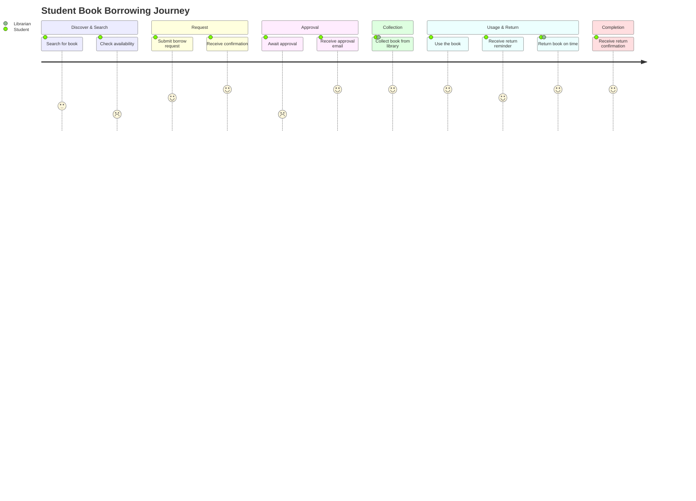

# Customer Journey Map
# Smart Library Request Workflow — SmartBridge × ServiceNow

> **Phase:** 2 — Requirement Analysis  
> **Document:** Customer Journey Map  
> **Project:** Smart Library Request Workflow  
> **Version:** 1.0.0

---

## 1. Student Journey — Book Borrowing

### Journey Overview

| Stage | Action | Touchpoint | Emotion | Pain Point | Opportunity |
|-------|--------|-----------|---------|-----------|-------------|
| **1. Discover** | Student realizes they need a specific book for coursework | Academic advisor, syllabus | 😐 Neutral | Doesn't know if library has the book | Portal search with availability |
| **2. Search** | Student searches library catalog | Library Portal / Physical library | 😕 Frustrated | Must visit physically or call to check | Real-time online catalog |
| **3. Request** | Student submits a borrow request | Service Portal | 😊 Hopeful | Form is confusing; no validation feedback | Streamlined catalog item with inline validation |
| **4. Wait** | Student awaits librarian approval | Email / Phone call | 😟 Anxious | No status visibility; doesn't know if request was seen | My Requests portal page with live status |
| **5. Receive Approval** | Student receives approval notification | Email | 😊 Happy | Email sometimes goes to spam | In-platform + email dual notification |
| **6. Collect Book** | Student visits library to collect approved book | Library counter | 😊 Satisfied | May miss pickup window | 3-day pickup window with deadline in notification |
| **7. Use Book** | Student uses the book for study | — | 😊 Happy | — | — |
| **8. Reminder** | Student receives due-date reminder | Email | 😐 Neutral | Sometimes forgets before reminder arrives | Proactive reminders at Day -7 and Day -3 |
| **9. Return** | Student returns book to library | Library counter | 😊 Relieved | No confirmation receipt | Return confirmation notification (LIB-NOTIF-005) |
| **10. Overdue** *(if applicable)* | Student returns book late | Email escalation | 😳 Embarrassed | Didn't know it was overdue | Day 1/3/7/14 tiered reminders |

### Journey Map Diagram

---

## 2. Librarian Journey — Processing a Borrow Request

| Stage | Action | System Touchpoint | Emotion | Pain (Before) | Solution |
|-------|--------|------------------|---------|--------------|---------|
| **1. Notification** | Librarian receives new request alert | Email + ServiceNow notification | 😊 Alert | Email buried in inbox | In-platform notification center |
| **2. Review** | Opens and reviews request details | ServiceNow form | 😐 Neutral | Manual availability check | Auto-check: availability shown on form |
| **3. Decision** | Approves or rejects the request | Approval task | 😊 Efficient | No structured form; verbal decision | Approval form with mandatory reason field |
| **4. Issuance** | Confirms physical book handover | Issuance record | 😊 Satisfied | Manual entry of issue/return dates | Auto-calculated return date |
| **5. Return Processing** | Receives and processes book return | Return record form | 😊 Efficient | Manual availability update in spreadsheet | BR-11 auto-increments availability |
| **6. Overdue Follow-up** | Contacts overdue students | Notification + Task | 😟 Frustrated | Manual emails one-by-one | Automated tiered notifications |

---

## 3. Library Manager Journey — Operational Monitoring

| Stage | Action | System Touchpoint | Emotion | Pain (Before) | Solution |
|-------|--------|------------------|---------|--------------|---------|
| **1. Morning Check** | Reviews library operations status | Dashboard | 😐 Concerned | No single view; checks multiple spreadsheets | Library Operations Dashboard with KPIs |
| **2. Escalation** | Receives escalated approval alert | Email + Task | 😟 Pressed | Phone call escalation with no documentation | Structured Escalation flow + audit trail |
| **3. Override** | Overrides an approval decision | Approval override form | 😐 Careful | No documented override process | Override action with mandatory notes |
| **4. Reporting** | Reviews weekly library statistics | Scheduled report email | 😊 Informed | 3-4 hours of manual report building | Auto-generated PDF report sent weekly |

---

## 4. Key Moments of Truth

| Moment | User | What They Need | System Response |
|--------|------|---------------|----------------|
| "Is this book available?" | Student | Instant, accurate availability answer | Portal badge: "4 copies available" |
| "Was my request received?" | Student | Immediate confirmation | LIB-NOTIF-001: Confirmation email within 60s |
| "What's the decision?" | Student | Clear, timely approval or rejection | LIB-NOTIF-002/003 within 48h |
| "What do I do about this overdue?" | Librarian | Clear escalation path | Automatic Task creation after Day 14 |
| "How is the library performing?" | Manager | At-a-glance operational metrics | 4 KPI cards + 2 trend charts on dashboard |

---

*Phase 1: [Ideation Phase](../1.%20Ideation%20Phase/)*  
*Next in Phase 2: [Data Flow Diagrams and User Stories](Data%20Flow%20Diagrams%20and%20User%20Stories.md)*
