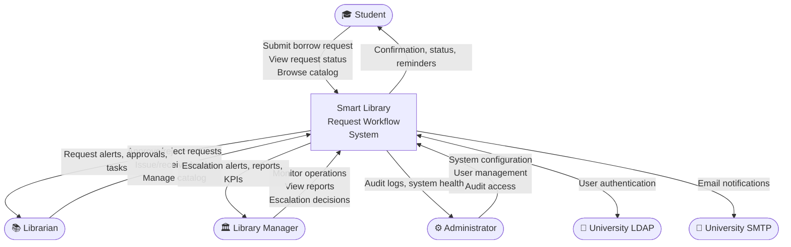
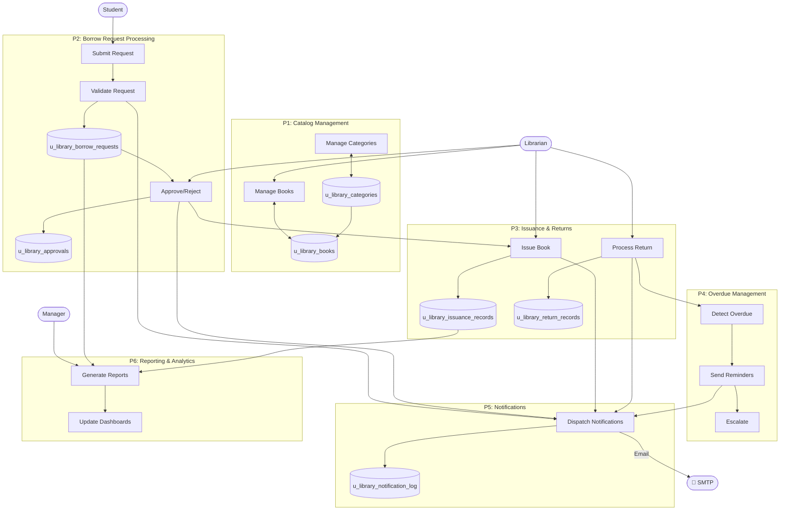
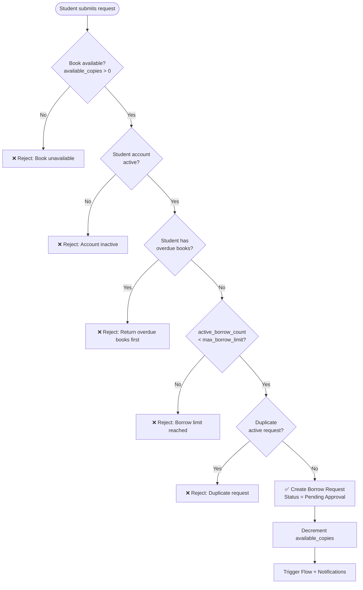

# Data Flow Diagrams and User Stories
# Smart Library Request Workflow — SmartBridge × ServiceNow

> **Phase:** 2 — Requirement Analysis  
> **Document:** Data Flow Diagrams & User Stories  
> **Project:** Smart Library Request Workflow  
> **Version:** 1.0.0

---

## Part A — Data Flow Diagrams

---

### DFD Level 0 — Context Diagram

---

### DFD Level 1 — Main Processes

---

### DFD Level 2 — Borrow Request Validation

---

## Part B — User Stories

### Student Stories

| ID | As a... | I want to... | So that... | FR Ref |
|----|---------|-------------|-----------|--------|
| STU-01 | Student | Search the book catalog by title, author, or ISBN | I can find books I need quickly | FR-01, FR-15 |
| STU-02 | Student | See real-time book availability before requesting | I don't waste time requesting unavailable books | FR-01-AC-5/6 |
| STU-03 | Student | Submit a borrow request through the Service Portal | I can initiate borrowing without visiting the library | FR-05 |
| STU-04 | Student | See validation errors inline when submitting a request | I understand exactly why my request was rejected | FR-05-AC-4/5/6 |
| STU-05 | Student | View the status of all my requests in real time | I don't need to call the library for updates | FR-15-AC-5 |
| STU-06 | Student | Receive an email when my request is submitted | I know the system received my request | FR-10-AC-1 |
| STU-07 | Student | Receive an email when my request is approved | I know when and how to collect my book | FR-10-AC-2 |
| STU-08 | Student | Receive an email when my request is rejected | I understand the reason and can resubmit | FR-10-AC-3 |
| STU-09 | Student | Receive a notification when my book is issued | I know my loan period and return date | FR-10-AC-4 |
| STU-10 | Student | Receive overdue reminders before and after my due date | I return books on time and maintain my borrowing privileges | FR-09, FR-10-AC-6 |
| STU-11 | Student | Cancel my pending request before it is approved | I can change my mind without the book being held | FR-13-AC-2 |
| STU-12 | Student | View my complete borrowing history | I can track what I've borrowed over time | FR-03-AC-7 |

### Librarian Stories

| ID | As a... | I want to... | So that... | FR Ref |
|----|---------|-------------|-----------|--------|
| LIB-01 | Librarian | Add, update, and deactivate book records | The catalog reflects the current physical collection | FR-01 |
| LIB-02 | Librarian | Receive a notification when a new request arrives | I can action it within the SLA | FR-10-AC-7 |
| LIB-03 | Librarian | Approve a request by clicking Approve with optional notes | Approvals are documented and trigger the issuance step | FR-06-AC-2 |
| LIB-04 | Librarian | Reject a request and provide a mandatory reason | Students understand why and can resubmit | FR-06-AC-3 |
| LIB-05 | Librarian | Record physical book handover to update status to Issued | Inventory and student records are accurate | FR-07-AC-3 |
| LIB-06 | Librarian | Process a book return with damage flagging | Returns are documented and damage is escalated | FR-08 |
| LIB-07 | Librarian | See all overdue books in a single dashboard view | I can follow up proactively | FR-12-AC-1 |
| LIB-08 | Librarian | View inventory status across all categories | I can advise students on availability | FR-11-AC-5 |

### Library Manager Stories

| ID | As a... | I want to... | So that... | FR Ref |
|----|---------|-------------|-----------|--------|
| MGR-01 | Library Manager | Receive escalation alerts for approvals unactioned after 48h | I can intervene before the SLA is severely breached | FR-06-AC-4, FR-10-AC-8 |
| MGR-02 | Library Manager | Override an approval decision with documented reason | I can correct incorrect decisions with full audit trail | FR-06-AC-7 |
| MGR-03 | Library Manager | View a real-time dashboard with KPI cards | I can monitor library health at a glance | FR-12 |
| MGR-04 | Library Manager | Access 8 standard reports on demand | I can make data-driven decisions | FR-11 |
| MGR-05 | Library Manager | Receive a weekly report via email automatically | I stay informed without manually generating reports | FR-11-AC-7 |
| MGR-06 | Library Manager | Manage book categories and deactivate outdated ones | The catalog taxonomy remains relevant | FR-02 |

### Administrator Stories

| ID | As a... | I want to... | So that... | FR Ref |
|----|---------|-------------|-----------|--------|
| ADM-01 | Administrator | Assign library roles to users from the admin interface | Only authorized users access the system | FR-13, FR-17-AC-2 |
| ADM-02 | Administrator | Read the immutable audit log filtered by user and date | I can investigate incidents and prove compliance | FR-14 |
| ADM-03 | Administrator | Configure system parameters from a single interface | Policy changes don't require code deployments | FR-16 |
| ADM-04 | Administrator | Manually trigger the overdue detection job | I can run ad-hoc overdue checks without waiting for the schedule | FR-17-AC-5 |
| ADM-05 | Administrator | View the notification delivery log with failure status | I can investigate and reprocess failed notifications | FR-17-AC-6 |

---

*Phase 1: [Ideation Phase](../1.%20Ideation%20Phase/)*  
*Next: [Solution Requirements](Solution%20Requirements.md)*
