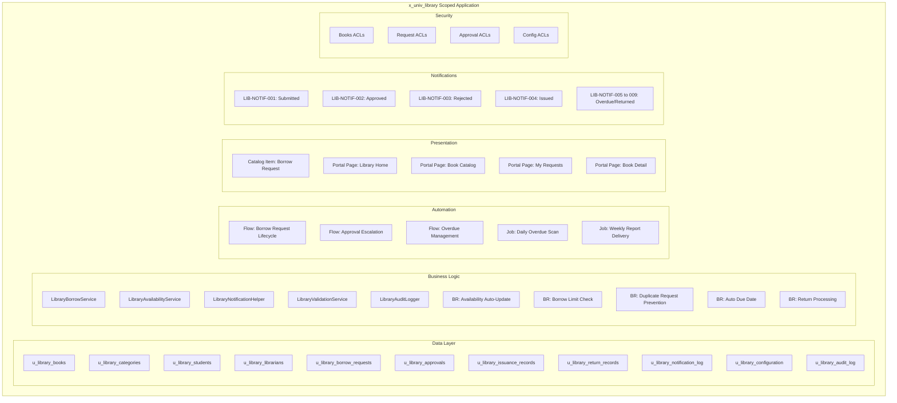

# Application Architecture

# Smart Library Request Workflow — ServiceNow Enterprise Solution

> **Document Type:** Application Architecture  
> **Version:** 2.0.0  
> **References:** NFR-05 (Maintainability), NFR-03 (Security)  
> **Status:** Final — Complete

---

## 1. Application Scope

The application is packaged as a **ServiceNow Scoped Application** with the following identity:

| Attribute | Value |
| ----------- | ------- |
| **Application Name** | Smart Library Request Workflow |
| **Scope Prefix** | `x_univ_library` |
| **Scope Name** | `x_univ_library` |
| **Vendor** | SmartBridge Technologies |
| **Compatible Version** | ServiceNow Washington DC or later |
| **Packaging** | Update Set |
| **Studio Module** | Yes — managed via ServiceNow Studio |

> **Naming Convention:** All artifacts created for this application use the prefix `u_library_` for tables and fields, and `x_univ_library` for the scope.

---

## 2. Component Architecture



---

## 3. Script Include Architecture

All reusable business logic is encapsulated in five Script Includes. This ensures no logic duplication between Business Rules and Flow Designer actions (ref. NFR-05-AC-1).

### 3.1 LibraryBorrowService

**Purpose:** Central service for borrow request lifecycle operations.

```javascript
var LibraryBorrowService = Class.create();
LibraryBorrowService.prototype = {
    initialize: function() {},

    // Validates and creates a borrow request
    createBorrowRequest: function(bookSysId, studentSysId, pickupDate, notes) {},

    // Cancels a borrow request and restores availability
    cancelBorrowRequest: function(requestSysId, reason) {},

    // Checks if student can borrow (limit, overdue, active status)
    canStudentBorrow: function(studentSysId, bookSysId) {},

    // Returns student's current active borrow count
    getActiveBorrowCount: function(studentSysId) {},

    type: 'LibraryBorrowService'
};
```

### 3.2 LibraryAvailabilityService

**Purpose:** Manages book availability counters and status flags.

```javascript
var LibraryAvailabilityService = Class.create();
LibraryAvailabilityService.prototype = {
    initialize: function() {},

    // Decrements available_copies and updates availability_status
    decrementAvailability: function(bookSysId) {},

    // Increments available_copies and updates availability_status
    incrementAvailability: function(bookSysId) {},

    // Returns true if book has available copies
    isBookAvailable: function(bookSysId) {},

    type: 'LibraryAvailabilityService'
};
```

### 3.3 LibraryNotificationHelper

**Purpose:** Sends and logs all application notifications.

```javascript
var LibraryNotificationHelper = Class.create();
LibraryNotificationHelper.prototype = {
    initialize: function() {},

    // Sends a notification using the specified template ID
    sendNotification: function(templateId, recipientSysId, recordSysId) {},

    // Logs notification to u_library_notification_log
    logNotification: function(templateId, recipientSysId, eventType, status) {},

    // Checks master notification toggle in configuration
    isNotificationsEnabled: function() {},

    type: 'LibraryNotificationHelper'
};
```

### 3.4 LibraryValidationService

**Purpose:** Server-side validation library called from Business Rules and Flow actions.

```javascript
var LibraryValidationService = Class.create();
LibraryValidationService.prototype = {
    initialize: function() {},

    validateBorrowRequest: function(bookSysId, studentSysId) {},
    validateReturnRequest: function(requestSysId) {},
    validateBookUpdate: function(bookGr) {},
    isDuplicateRequest: function(bookSysId, studentSysId) {},

    type: 'LibraryValidationService'
};
```

### 3.5 LibraryAuditLogger

**Purpose:** Writes immutable records to `u_library_audit_log`.

```javascript
var LibraryAuditLogger = Class.create();
LibraryAuditLogger.prototype = {
    initialize: function() {},

    logEvent: function(tableName, recordSysId, action, fieldName, oldValue, newValue) {},
    logAccessDenial: function(tableName, recordSysId, operation, userId) {},

    type: 'LibraryAuditLogger'
};
```

---

## 4. Business Rule Architecture

| Rule ID | Name | Table | When | Condition | Purpose |
| --------- | ------ | ------- | ------ | ----------- | --------- |
| BR-01 | Availability Auto-Update | `u_library_books` | Before Update | `available_copies` changed | Auto-set `availability_status` |
| BR-02 | Default Available Copies | `u_library_books` | Before Insert | New record | Set `available_copies = total_copies` |
| BR-03 | ISBN Uniqueness Check | `u_library_books` | Before Insert/Update | `isbn` changed | Reject duplicate ISBNs |
| BR-04 | Total Copies Guard | `u_library_books` | Before Update | `total_copies` decreased | Reject if < borrowed count |
| BR-05 | Book Deactivation Guard | `u_library_books` | Before Update | `active` set to false | Block if active requests exist |
| BR-06 | Borrow Limit Check | `u_library_borrow_requests` | Before Insert | New request | Enforce student borrow limit |
| BR-07 | Overdue Block | `u_library_borrow_requests` | Before Insert | New request | Block if student has overdue |
| BR-08 | Duplicate Request Block | `u_library_borrow_requests` | Before Insert | New request | Prevent duplicate active requests |
| BR-09 | Availability Decrement | `u_library_borrow_requests` | After Insert | Status = Pending Approval | Decrement book availability |
| BR-10 | Rejection Availability Restore | `u_library_approvals` | After Update | Decision = Rejected | Increment book availability |
| BR-11 | Return Availability Restore | `u_library_return_records` | After Insert | New return record | Increment book availability |
| BR-12 | Overdue Flag Set | `u_library_borrow_requests` | Async | Daily scheduled | Set overdue_flag on past-due records |
| BR-13 | Student Profile Auto-Create | `sys_user_has_role` | After Insert | Role = student_library | Create student profile record |
| BR-14 | Librarian Profile Auto-Create | `sys_user_has_role` | After Insert | Role = librarian_library | Create librarian profile record |
| BR-15 | Audit Event Logger | Multiple tables | After Insert/Update/Delete | Any change | Write to audit log |

---

## 5. Flow Designer Architecture

### Flow 1: Borrow Request Lifecycle

```text
Trigger: Record Created on u_library_borrow_requests
         (status = Pending Approval)
    │
    ├── Action: Send Notification (LIB-NOTIF-001) to Student
    ├── Action: Send Notification (LIB-NOTIF-010) to Librarian Group
    ├── Action: Create Approval Task → librarian_library group
    │
    ├── Wait: Approval Decision OR 48-hour SLA
    │
    ├── [Branch: Approved within 48h]
    │       ├── Set Request status = Approved
    │       ├── Send Notification (LIB-NOTIF-002) to Student
    │       └── Sub-flow: Book Issuance
    │
    ├── [Branch: Rejected within 48h]
    │       ├── Set Request status = Rejected
    │       ├── Restore book available_copies
    │       └── Send Notification (LIB-NOTIF-003) to Student
    │
    └── [Branch: 48h SLA Breach]
            ├── Set Request status = Escalated
            ├── Reassign Approval to library_manager group
            └── Send Notification (LIB-NOTIF-011) to Library Manager
```

### Flow 2: Book Issuance Sub-Flow

```text
Trigger: Called from Borrow Request Lifecycle flow (Approved)
    │
    ├── Create Issuance Record
    ├── Calculate expected_return_date (today + loan_period_days)
    ├── Wait: Librarian confirms physical handover
    ├── Set Request status = Issued
    └── Send Notification (LIB-NOTIF-004) to Student
```

### Flow 3: Overdue Management (Scheduled)

```text
Trigger: Scheduled — Daily at 06:00
    │
    ├── Query: All Issued requests with expected_return_date < today
    ├── For each overdue request:
    │       ├── Set overdue_flag = true
    │       ├── Calculate overdue_days
    │       └── [Branch by overdue_days]
    │               ├── Day 1  → Send LIB-NOTIF-006
    │               ├── Day 3  → Send LIB-NOTIF-007
    │               ├── Day 7  → Send LIB-NOTIF-008
    │               ├── Day 14 → Send LIB-NOTIF-009 + Escalate to Manager
    │               └── Day 15+ → Create follow-up task for Library Manager
    └── Log job execution to u_library_audit_log
```

---

## 6. Navigation & Application Menu

The following application menu is configured and active in the `x_univ_library` scope:

```text
📚 Library Management (Application Menu)
├── 📖 Books
│   ├── All Books
│   ├── Available Books
│   └── Add Book
├── 🏷️ Categories
│   └── All Categories
├── 📋 Borrow Requests
│   ├── All Requests
│   ├── Pending Approval
│   ├── Overdue Requests
│   └── My Requests (Student view)
├── ✅ Approvals
│   ├── Pending Approvals
│   └── Approval History
├── 🎓 Students
│   └── All Students
├── 👩‍💼 Librarians
│   └── All Librarians
├── 📊 Reports
│   ├── Books Borrowed per Month
│   ├── Overdue Books Report
│   ├── Inventory Status
│   └── Student Activity
├── 📈 Dashboards
│   ├── Library Operations Dashboard
│   └── Student Self-Service Dashboard
└── ⚙️ Administration
    ├── Configuration
    ├── Notification Log
    └── Audit Log
```

The menu is automatically available to users with the appropriate roles. Role-based filtering ensures each user only sees modules they have permission to access. The menu was configured using ServiceNow Application Menu records and deployed as part of the scoped application Update Set.

---

*References: [requirements.md](../../.kiro/specs/smart-library-request-workflow/requirements.md)*  
*See also: [SystemArchitecture.md](SystemArchitecture.md) | [FlowDesigner.md](../servicenow/FlowDesigner.md)*
