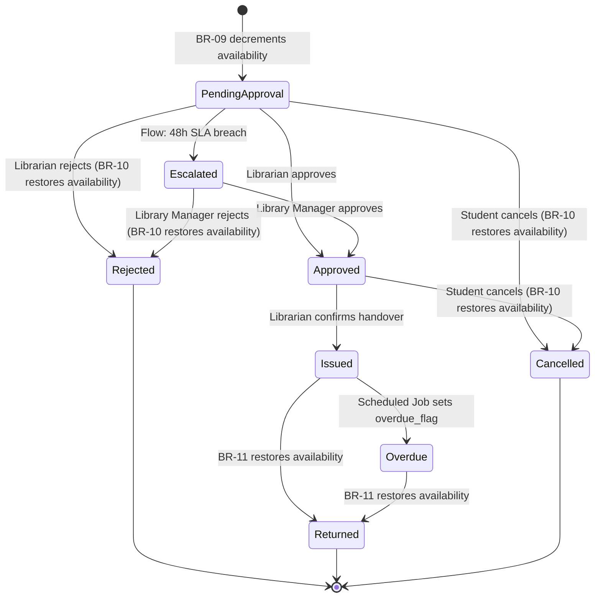

# Database Design

# Smart Library Request Workflow — ServiceNow Enterprise Solution

> **Document Type:** Database Design  
> **Version:** 2.0.0  
> **Application Scope:** `x_univ_library`  
> **Status:** Final — Complete

---

## 1. Naming Standards

All database artifacts follow consistent naming conventions:

| Artifact | Convention | Example |
| ---------- | ----------- | --------- |
| Table names | `u_library_<entity>` | `u_library_books` |
| Field names | `u_<field_name>` | `u_title`, `u_isbn` |
| Application scope | `x_univ_library` | — |
| Business Rule names | `[LIB] Description` | `[LIB] Availability Auto-Update` |
| Script Include names | `Library<Service>` | `LibraryBorrowService` |
| Notification names | `[LIB] Event Name` | `[LIB] Borrow Request Submitted` |

---

## 2. Table Creation Order

Tables must be created in this order to satisfy foreign key dependencies:

```text
1. u_library_categories          (no dependencies)
2. u_library_books               (depends on: categories)
3. u_library_students            (depends on: sys_user)
4. u_library_librarians          (depends on: sys_user, categories)
5. u_library_borrow_requests     (depends on: books, students)
6. u_library_approvals           (depends on: borrow_requests, sys_user)
7. u_library_issuance_records    (depends on: borrow_requests, books, students, librarians)
8. u_library_return_records      (depends on: borrow_requests, librarians)
9. u_library_notification_log    (depends on: sys_user)
10. u_library_configuration      (depends on: sys_user)
11. u_library_audit_log          (depends on: sys_user)
```

---

## 3. Validation Rules Summary

### Books (u_library_books)

| Field | Validation Rule | Error Message |
| ------- | ---------------- | --------------- |
| `u_isbn` | UNIQUE across all records | "A book with this ISBN already exists." |
| `u_total_copies` | Cannot be reduced below (total - available) | "Total copies cannot be less than currently borrowed copies." |
| `u_publication_year` | Integer between 1000 and current year | "Publication year must be between 1000 and [current year]." |
| `u_available_copies` | 0 ≤ value ≤ `u_total_copies` | System-maintained; not user-editable |
| `u_availability_status` | Auto-maintained by Business Rule | System-maintained; not user-editable |
| Book deactivation | Cannot deactivate if active borrows exist | "Cannot deactivate this book. [N] active borrow request(s) exist." |

### Students (u_library_students)

| Field | Validation Rule | Error Message |
| ------- | ---------------- | --------------- |
| `u_university_id` | UNIQUE across all records | "A student with this university ID already exists." |
| `u_max_borrow_limit` | Integer between 1 and 20 | "Maximum borrow limit must be between 1 and 20." |

### Librarians (u_library_librarians)

| Field | Validation Rule | Error Message |
|-------|----------------|---------------|
| `u_staff_id` | UNIQUE across all records | "A librarian with this staff ID already exists." |

### Borrow Requests (u_library_borrow_requests)

| Field | Validation Rule | Error Message |
| ------- | ---------------- | --------------- |
| `u_book` | Book must have available_copies > 0 | "This book is currently unavailable. Please check back later." |
| `u_student` | Student must be active | "Your student account is inactive. Contact the library." |
| `u_student` (overdue) | Student must have no overdue requests | "You have overdue books. Please return them before requesting new books." |
| `u_student` (limit) | active_borrow_count < max_borrow_limit | "You have reached your maximum borrow limit of [N] books." |
| Duplicate check | No active Pending/Approved request for same book | "You already have an active request for this book." |
| `u_requested_pickup_date` | Between 1 and 30 days from today | "Pickup date must be between 1 and 30 days from today." |
| `u_notes` | Max 500 characters | "Notes cannot exceed 500 characters." |

### Approvals (u_library_approvals)

| Field | Validation Rule | Error Message |
| ------- | ---------------- | --------------- |
| `u_reason` | Required when decision = Rejected | "A rejection reason is required." |
| `u_reason` | Max 500 characters | "Rejection reason cannot exceed 500 characters." |

### Configuration (u_library_configuration)

| Validation | Rule |
| ----------- | ------ |
| Numeric parameters | Must be positive integers |
| Boolean parameters | Must be "true" or "false" |
| List parameters | Comma-separated positive integers |

---

## 4. State Machine — Borrow Request Status



---

## 5. Sample Records

### Sample: u_library_categories

```text
sys_id: cat001 | u_name: Science & Technology   | u_active: true  | u_icon: icon-science
sys_id: cat002 | u_name: Literature & Fiction    | u_active: true  | u_icon: icon-book
sys_id: cat003 | u_name: History & Culture       | u_active: true  | u_icon: icon-history
sys_id: cat004 | u_name: Mathematics             | u_active: true  | u_icon: icon-math
sys_id: cat005 | u_name: Computer Science        | u_active: true  | u_icon: icon-computer
sys_id: cat006 | u_name: Business & Economics    | u_active: true  | u_icon: icon-business
sys_id: cat007 | u_name: Medicine & Health       | u_active: true  | u_icon: icon-health
sys_id: cat008 | u_name: Arts & Humanities       | u_active: true  | u_icon: icon-arts
```

### Sample: u_library_books (5 of 500)

```text
u_isbn: 978-0-13-468599-1 | u_title: Clean Code                    | u_author: Robert C. Martin    | u_category: Computer Science | u_total_copies: 5 | u_available_copies: 3
u_isbn: 978-0-13-235088-4 | u_title: The Pragmatic Programmer      | u_author: Andrew Hunt          | u_category: Computer Science | u_total_copies: 4 | u_available_copies: 4
u_isbn: 978-0-06-112008-4 | u_title: To Kill a Mockingbird         | u_author: Harper Lee           | u_category: Literature       | u_total_copies: 8 | u_available_copies: 5
u_isbn: 978-0-14-028329-7 | u_title: A Brief History of Time       | u_author: Stephen Hawking      | u_category: Science          | u_total_copies: 6 | u_available_copies: 2
u_isbn: 978-0-07-802215-9 | u_title: Engineering Mathematics       | u_author: K.A. Stroud          | u_category: Mathematics      | u_total_copies: 10| u_available_copies: 7
```

### Sample: u_library_borrow_requests (3 of 1000)

```text
u_number: LIB-00000001 | u_book: Clean Code | u_student: S001 | u_status: Issued    | u_submitted_at: 2024-01-10 09:00
u_number: LIB-00000002 | u_book: A Brief History... | u_student: S002 | u_status: Pending Approval | u_submitted_at: 2024-01-14 14:30
u_number: LIB-00000003 | u_book: To Kill a Mockingbird | u_student: S003 | u_status: Returned  | u_submitted_at: 2024-01-05 11:15
```

---

## 6. Data Retention Policy

| Table | Retention Period | Policy |
| ------- | ----------------- | -------- |
| u_library_books | Indefinite (while record is active) | Deactivation, not deletion |
| u_library_borrow_requests | 7 years minimum | Per university records retention policy (ref. NFR-07) |
| u_library_approvals | 7 years minimum | Follows parent borrow request |
| u_library_issuance_records | 7 years minimum | Physical handover evidence |
| u_library_return_records | 7 years minimum | Return processing evidence |
| u_library_audit_log | 3 years minimum | Compliance requirement (ref. FR-14-AC-2) |
| u_library_notification_log | 1 year | Operational log |
| u_library_configuration | Indefinite | System configuration |

---

*References: [requirements.md](../../.kiro/specs/smart-library-request-workflow/requirements.md) — Section 9 (Data Model Overview), FR-01 through FR-09*  
*See also: [ERDiagram.md](ERDiagram.md) | [DataDictionary.md](DataDictionary.md)*
