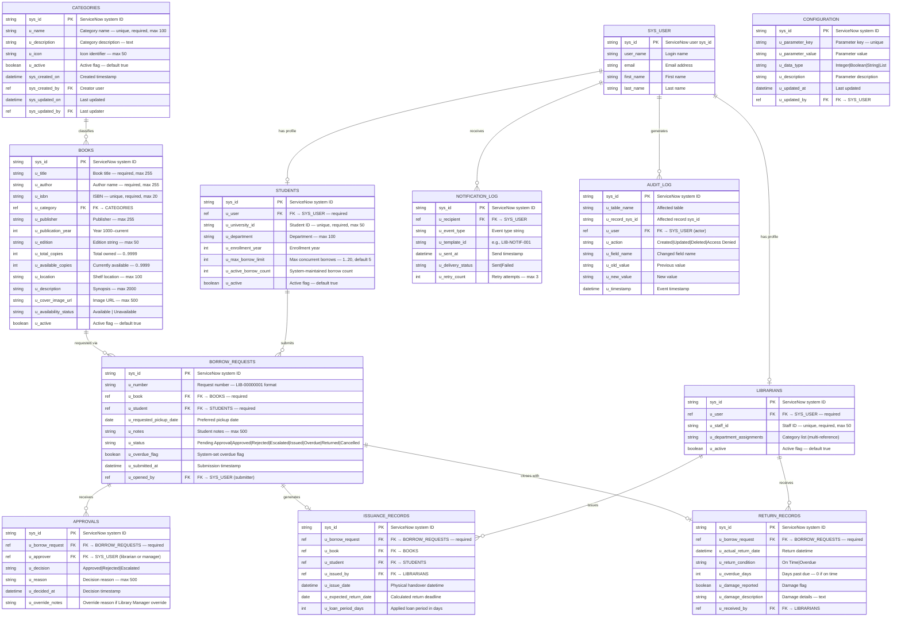

# Entity Relationship Diagram

# Smart Library Request Workflow — ServiceNow Enterprise Solution

> **Document Type:** Entity Relationship Diagram  
> **Version:** 2.0.0  
> **Application Scope:** `x_univ_library`  
> **Status:** Final — Complete

---

## 1. Complete ER Diagram

---

## 2. Relationship Summary

| Relationship | Type | Description |
| ------------- | ------ | ------------- |
| Category → Books | One-to-Many | A category classifies many books |
| SYS_USER → Students | One-to-Zero/One | Each ServiceNow user may have one student profile |
| SYS_USER → Librarians | One-to-Zero/One | Each ServiceNow user may have one librarian profile |
| Books → Borrow Requests | One-to-Many | A book can be requested many times |
| Students → Borrow Requests | One-to-Many | A student submits many requests |
| Borrow Requests → Approvals | One-to-Many | A request can have multiple approval records (override history) |
| Borrow Requests → Issuance Records | One-to-Zero/One | An approved request generates one issuance record |
| Borrow Requests → Return Records | One-to-Zero/One | An issued request generates one return record |
| Librarians → Issuance Records | One-to-Many | A librarian issues many books |
| Librarians → Return Records | One-to-Many | A librarian receives many returns |

---

## 3. Key Constraints

| Table | Field | Constraint |
| ------- | ------- | ----------- |
| BOOKS | `u_isbn` | UNIQUE across all records |
| BOOKS | `u_available_copies` | 0 ≤ value ≤ `u_total_copies` |
| BOOKS | `u_total_copies` | Cannot be set below current borrowed count |
| STUDENTS | `u_university_id` | UNIQUE across all records |
| STUDENTS | `u_max_borrow_limit` | 1 ≤ value ≤ 20 |
| LIBRARIANS | `u_staff_id` | UNIQUE across all records |
| BORROW_REQUESTS | `u_number` | UNIQUE, auto-generated `LIB-XXXXXXXX` |
| CATEGORIES | `u_name` | UNIQUE among active categories |
| CONFIGURATION | `u_parameter_key` | UNIQUE across all records |
| AUDIT_LOG | All fields | READ-ONLY — no update or delete permitted |

---

## 4. Index Strategy

| Table | Indexed Fields | Rationale |
| ------- | --------------- | ----------- |
| BOOKS | `u_isbn`, `u_title`, `u_author`, `u_available_copies`, `u_active` | ISBN lookups, portal search, availability queries |
| CATEGORIES | `u_name`, `u_active` | Category browse and deactivation guard |
| STUDENTS | `u_university_id`, `u_user`, `u_active` | Profile lookup, role assignment trigger |
| BORROW_REQUESTS | `u_student`, `u_book`, `u_status`, `u_overdue_flag`, `u_submitted_at` | Active borrow queries, overdue detection |
| APPROVALS | `u_borrow_request`, `u_decided_at` | SLA calculation, escalation detection |
| ISSUANCE_RECORDS | `u_borrow_request`, `u_expected_return_date` | Overdue date comparisons |
| AUDIT_LOG | `u_table_name`, `u_user`, `u_timestamp` | Admin audit searches |

---

*References: [requirements.md](../../.kiro/specs/smart-library-request-workflow/requirements.md) — Section 9 (Data Model Overview)*  
*See also: [DataDictionary.md](DataDictionary.md) | [DatabaseDesign.md](DatabaseDesign.md)*
