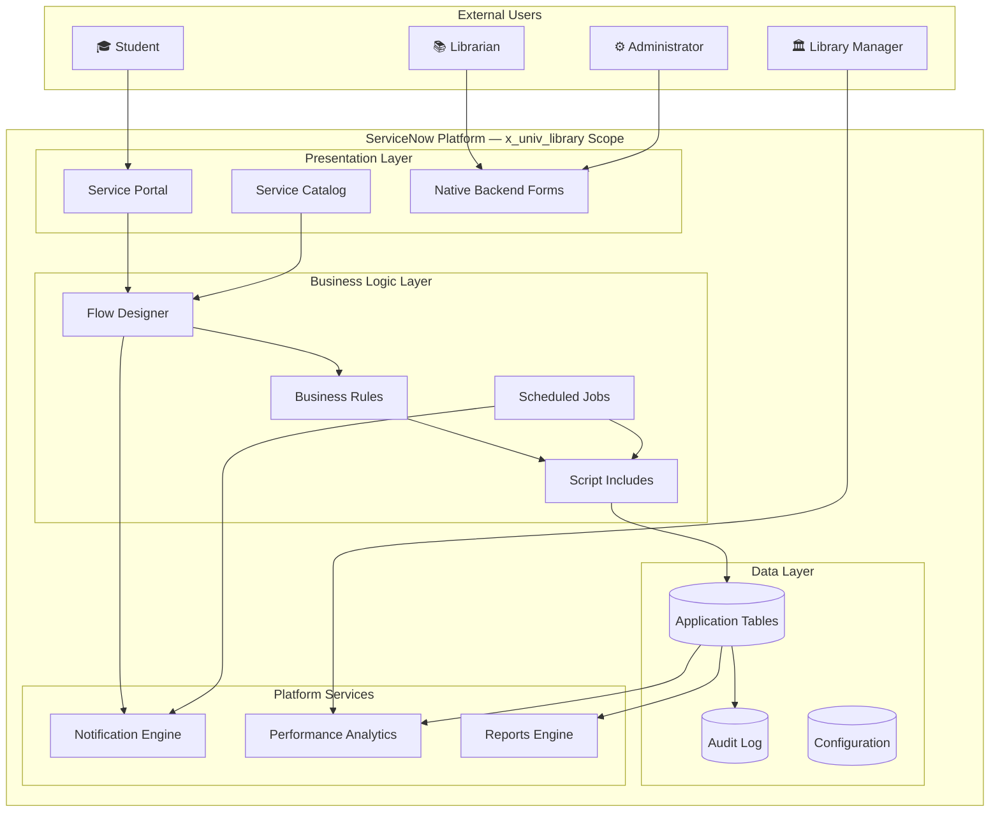
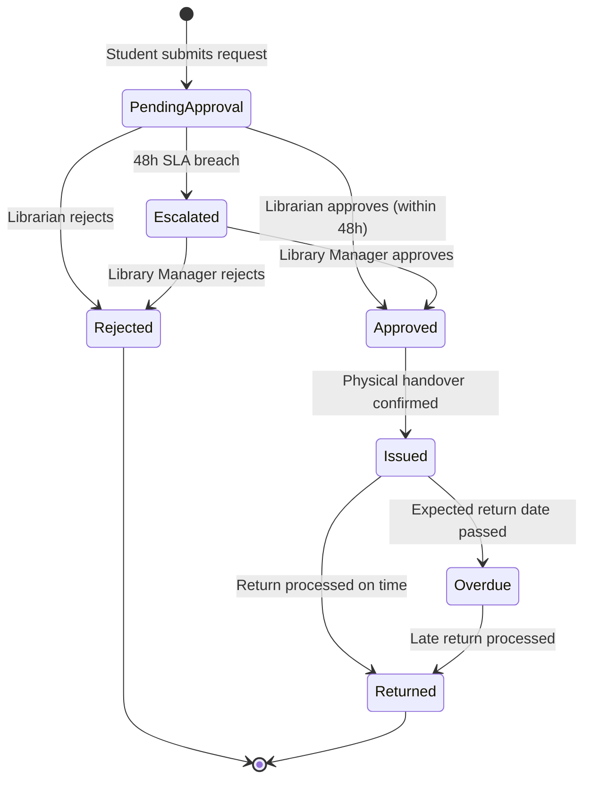

# Project Overview

# Smart Library Request Workflow — ServiceNow Enterprise Solution

> **Document Type:** Project Overview  
> **Version:** 2.0.0  
> **Status:** Final — Complete  
> **Application Scope:** `x_univ_library`

---

## 1. Executive Summary

The **Smart Library Request Workflow** is a fully designed enterprise ServiceNow scoped application for a university library. It replaces fragmented, paper-based borrowing processes with a unified, automated, role-aware digital workflow running natively on the ServiceNow platform.

The solution covers the complete book borrowing lifecycle — from catalog browsing through approval, issuance, return, and overdue management — while providing real-time dashboards, scheduled reports, and a self-service Service Portal for students.

---

## 2. Project Identification

| Attribute | Value |
| ----------- | ------- |
| **Project Name** | Smart Library Request Workflow |
| **Platform** | ServiceNow (Washington DC or later) |
| **Application Scope** | `x_univ_library` |
| **Industry** | Higher Education |
| **Domain** | Library Management |
| **Project Type** | Enterprise ServiceNow Scoped Application |
| **Development Phase** | Complete — Deployed |
| **Organization** | SmartBridge Technologies — ServiceNow Practice |

---

## 3. Business Context

### 3.1 Problem Statement

University libraries managing thousands of books and hundreds of concurrent borrowers face significant challenges with manual processes:

| Challenge | Impact |
| ----------- | -------- |
| No centralized book availability tracking | Students waste time checking shelves manually |
| Approval decisions made via email | No audit trail, inconsistent decisions |
| No automated overdue detection | Books go missing without follow-up |
| Manual spreadsheet reporting | Reports are delayed and often inaccurate |
| Inconsistent borrowing limit enforcement | Policy violations go undetected |
| No student self-service capability | High librarian workload for status queries |

### 3.2 Solution Value

| Objective | Solution Component |
| ----------- | ------------------- |
| Reduce manual paperwork | Digital Service Catalog request workflow |
| Automate approvals | Flow Designer multi-stage approval with SLA escalation |
| Real-time inventory tracking | Books table with auto-maintained availability counters |
| Automated overdue management | Scheduled job + tiered notification system |
| Centralized reporting | 8 standard reports + Performance Analytics dashboards |
| Student self-service | Service Portal with request status and history |
| Role-based access | 4-role ACL model enforced across all tables |
| Audit compliance | Immutable audit log retained for 3+ years |

---

## 4. Application Architecture Summary

---

## 5. Application Modules

| Module | Table | Description |
| -------- | ------- | ------------- |
| **Books** | `u_library_books` | Catalog management and availability tracking |
| **Categories** | `u_library_categories` | Book classification taxonomy |
| **Students** | `u_library_students` | Student profiles and borrow limits |
| **Librarians** | `u_library_librarians` | Staff profiles and department assignments |
| **Borrow Requests** | `u_library_borrow_requests` | Request lifecycle management |
| **Approvals** | `u_library_approvals` | Approval decisions and audit trail |
| **Issuance Records** | `u_library_issuance_records` | Physical handover tracking |
| **Return Records** | `u_library_return_records` | Return processing and condition tracking |
| **Notification Log** | `u_library_notification_log` | Notification delivery audit |
| **Configuration** | `u_library_configuration` | Centralized parameter store |
| **Audit Log** | `u_library_audit_log` | Immutable system event log |

---

## 6. Roles

| Role Name | System Role | Description |
| ----------- | ------------- | ------------- |
| Student | `student_library` | Browse catalog, submit and track own requests |
| Librarian | `librarian_library` | Manage books, process approvals, issue/return books |
| Library Manager | `library_manager` | All librarian capabilities + reports + escalation management |
| Administrator | `library_admin` | Full system access, configuration, user management |

---

## 7. Request Lifecycle

---

## 8. Key Metrics & Targets

| KPI | Target |
| ----- | -------- |
| Portal search response time | ≤ 2 seconds |
| Request submission processing | ≤ 3 seconds |
| Notification delivery | ≤ 60 seconds after trigger |
| Dashboard data refresh | ≤ 5 minutes |
| System uptime (operational hours) | ≥ 99.5% |
| Books catalog supported | Up to 50,000 records |
| Concurrent student profiles | Up to 5,000 |

---

## 9. Document Index

| Category | Document | Description |
| ---------- | ---------- | ------------- |
| Requirements | [Requirements Specification](../.kiro/specs/smart-library-request-workflow/requirements.md) | Authoritative requirements |
| Architecture | [System Architecture](architecture/SystemArchitecture.md) | Full platform architecture |
| Architecture | [Application Architecture](architecture/ApplicationArchitecture.md) | Scoped app design |
| Database | [ER Diagram](database/ERDiagram.md) | Entity relationships |
| Database | [Data Dictionary](database/DataDictionary.md) | Complete field reference |
| Implementation | [Implementation Guide](implementation/ImplementationGuide.md) | Step-by-step build guide |
| Implementation | [Deployment Guide](implementation/DeploymentGuide.md) | Release procedures |
| Testing | [Test Cases](tests/TestCases.md) | 100+ test scenarios |
| Guides | [User Manual](guides/UserManual.md) | End-user guide |
| Guides | [Admin Guide](guides/AdministratorGuide.md) | Administrator reference |

---

## 10. Implementation Summary

| Component | Status | Details |
| ----------- | -------- | --------- |
| Database Schema | ✅ Complete | 11 application tables created in `x_univ_library` scope |
| Business Rules | ✅ Complete | 15 server-side rules deployed and active |
| Flow Designer | ✅ Complete | 3 automated flows orchestrating the full lifecycle |
| Service Portal | ✅ Complete | 7 portal pages with full WCAG 2.1 AA compliance |
| ACL / Security | ✅ Complete | Role-based access enforced across all tables |
| Notifications | ✅ Complete | 13 notification templates with email delivery |
| Reports | ✅ Complete | 8 reports with scheduled delivery configured |
| Dashboards | ✅ Complete | 2 dashboards with PA indicators operational |

---

*For the authoritative requirements, see [requirements.md](../.kiro/specs/smart-library-request-workflow/requirements.md)*  
*For implementation instructions, see [ImplementationGuide.md](implementation/ImplementationGuide.md)*
