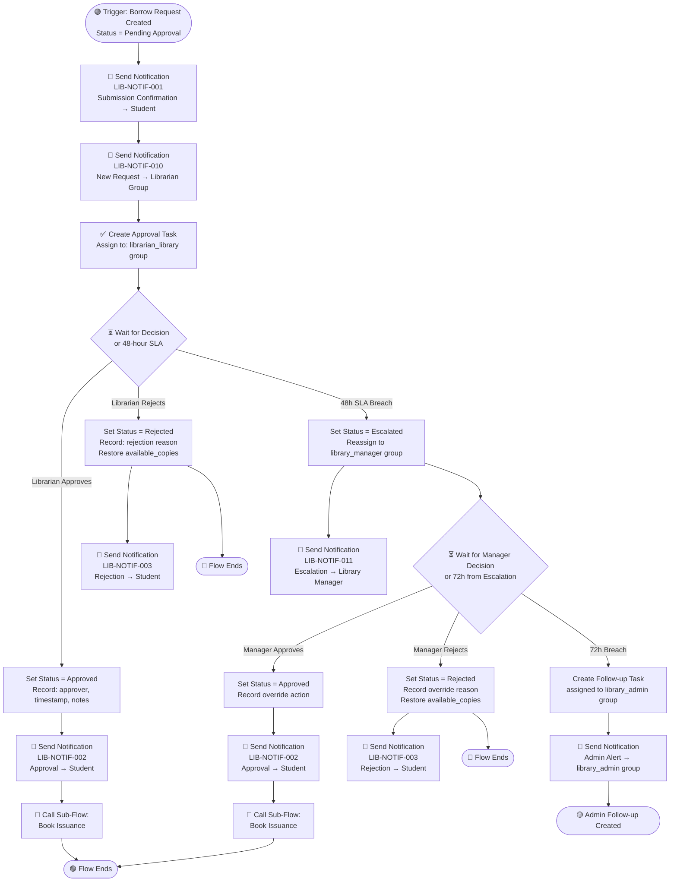
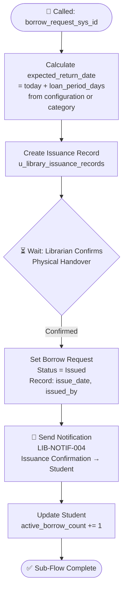
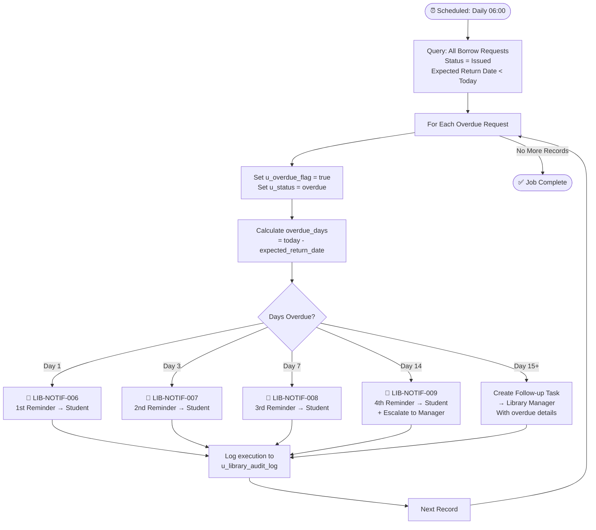

# Flow Designer Documentation

# Smart Library Request Workflow — ServiceNow Enterprise Solution

> **Document Type:** Flow Designer Design  
> **Version:** 2.0.0  
> **Application Scope:** `x_univ_library`  
> **Status:** Final — Complete

---

## Overview

The Smart Library Request Workflow uses three Flow Designer flows to automate the complete borrow request lifecycle. All flows run within the `x_univ_library` scope.

| Flow Name | Trigger | Purpose |
| ----------- | --------- | --------- |
| `[LIB] Borrow Request Lifecycle` | Record Created (u_library_borrow_requests) | Main orchestration flow |
| `[LIB] Book Issuance Sub-Flow` | Called by parent flow | Issue book after approval |
| `[LIB] Overdue Management` | Scheduled (daily) | Detect and notify overdue books |

---

## Flow 1: Borrow Request Lifecycle

### Trigger

- **Type:** Record Created  
- **Table:** `u_library_borrow_requests`  
- **Condition:** `status = Pending Approval`

### Flow Diagram



### Flow Steps — Detailed

| Step # | Step Type | Name | Configuration |
| -------- | ----------- | ------ | --------------- |
| 1 | Action: Send Notification | Submission Confirmation | Template: LIB-NOTIF-001, Recipient: `trigger.u_student.u_user` |
| 2 | Action: Send Notification | New Request Alert | Template: LIB-NOTIF-010, Recipient Group: `librarian_library` |
| 3 | Action: Ask for Approval | Librarian Approval | Approver: `librarian_library` group, Due: +48 hours |
| 4 | Flow Logic: If | Branch on Approval | Approved / Rejected / Timeout |
| 5a | Action: Update Record | Set Status = Approved | `u_library_borrow_requests.u_status = approved` |
| 5b | Action: Update Record | Set Status = Rejected | `u_status = rejected`; restore availability |
| 5c | Flow Logic: Escalation | Reassign to Manager | `u_status = escalated`; reassign to `library_manager` group |
| 6 | Action: Send Notification | Decision Notification | Template varies by branch |
| 7 | Action: Flow Sub-Flow | Book Issuance | Call `[LIB] Book Issuance Sub-Flow` |

---

## Flow 2: Book Issuance Sub-Flow

### Trigger

- **Type:** Called from parent flow (`[LIB] Borrow Request Lifecycle`)  
- **Input:** `borrow_request_sys_id`

### Flow Diagram



### Loan Period Calculation Logic

```text
1. Check u_library_configuration for category-specific loan period
   key: "loan_period_days_[category_sys_id]"
2. If not found, use default_loan_period_days (default: 14)
3. expected_return_date = issue_date + loan_period_days
```

---

## Flow 3: Overdue Management (Scheduled Flow)

### Trigger

- **Type:** Scheduled Trigger  
- **Frequency:** Daily at 06:00 (configurable)

### Flow Diagram



---

## Notification Templates Reference

All notifications used in flows:

| Template ID | Event | Recipient | Subject |
| ------------- | ------- | ----------- | --------- |
| `LIB-NOTIF-001` | Request Submitted | Student | "Your Library Request Has Been Received — [Request#]" |
| `LIB-NOTIF-002` | Request Approved | Student | "Your Library Request Has Been Approved — [Book Title]" |
| `LIB-NOTIF-003` | Request Rejected | Student | "Library Request Update — [Book Title]" |
| `LIB-NOTIF-004` | Book Issued | Student | "Your Book Is Ready — [Book Title]" |
| `LIB-NOTIF-005` | Book Returned | Student | "Return Confirmed — Thank You" |
| `LIB-NOTIF-006` | Overdue Day 1 | Student | "Reminder: Library Book Due Yesterday — [Book Title]" |
| `LIB-NOTIF-007` | Overdue Day 3 | Student | "Second Reminder: Overdue Library Book — [Book Title]" |
| `LIB-NOTIF-008` | Overdue Day 7 | Student | "Urgent: Library Book 7 Days Overdue — [Book Title]" |
| `LIB-NOTIF-009` | Overdue Day 14 | Student | "Final Notice: Overdue Library Book — Action Required" |
| `LIB-NOTIF-010` | New Pending Request | Librarian Group | "New Borrow Request Awaiting Approval — [Book Title]" |
| `LIB-NOTIF-011` | Approval Escalated | Library Manager | "Approval Escalated — Action Required Within 24 Hours" |
| `LIB-NOTIF-012` | Damage Reported | Library Manager | "Book Damage Report — [Book Title]" |
| `LIB-NOTIF-013` | Admin Follow-up | library_admin Group | "Library Workflow Escalation — Administrator Action Required" |

---

## SLA Configuration

Two SLA definitions are configured and active in the system:

| SLA Name | Table | Start Condition | Breach Duration | Action on Breach |
| ---------- | ------- | ---------------- | ----------------- | ----------------- |
| `[LIB] Librarian Approval SLA` | `u_library_approvals` | Status = Pending | 48 hours | Escalate to library_manager |
| `[LIB] Manager Approval SLA` | `u_library_approvals` | Status = Escalated | 72 hours from escalation | Create admin follow-up task |

The SLAs were configured using ServiceNow SLA Definition records. Each SLA timer starts automatically when the corresponding approval record is created with the matching status. On breach, the Flow Designer flow is triggered via a platform event, which handles the escalation or admin follow-up task creation. SLA performance metrics are captured in the timeline and available in the Approval Processing Time report (RPT-008).

---

*References: [requirements.md](../../.kiro/specs/smart-library-request-workflow/requirements.md) — FR-05 through FR-09, FR-10*  
*See also: [ApprovalWorkflow.md](../ApprovalWorkflow.md) | [Notifications.md](Notifications.md)*
