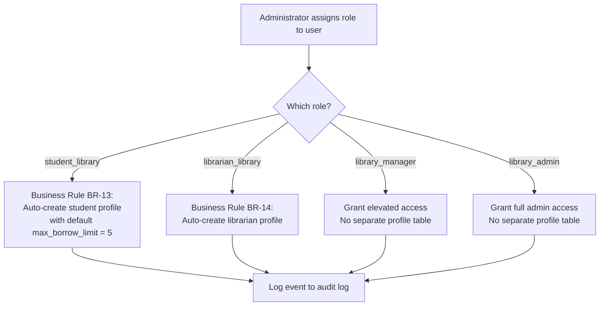

# Roles and Permissions

# Smart Library Request Workflow — ServiceNow Enterprise Solution

> **Document Type:** Roles & Permissions Design  
> **Version:** 2.0.0  
> **Application Scope:** `x_univ_library`  
> **Status:** Final — Complete

---

## 1. Role Definitions

| Role Name | System Name | Description |
| ----------- | ------------- | ------------- |
| Student | `student_library` | University student with a registered profile |
| Librarian | `librarian_library` | Library staff managing day-to-day operations |
| Library Manager | `library_manager` | Senior staff overseeing all operations |
| Administrator | `library_admin` | IT/system administrator with full access |

> **Important (ref. FR-13-AC-6):** Roles are implemented as discrete ACL rules. There is no actual role inheritance in ServiceNow to prevent unintended privilege escalation. Each role grants only the permissions explicitly specified.

---

## 2. Permission Matrix

| Action | student_library | librarian_library | library_manager | library_admin |
| -------- | :-: | :-: | :-: | :-: |
| **Books** | | | | |
| Read active books | ✅ | ✅ | ✅ | ✅ |
| Read inactive books | ❌ | ✅ | ✅ | ✅ |
| Create book records | ❌ | ✅ | ✅ | ✅ |
| Update book records | ❌ | ✅ | ✅ | ✅ |
| Deactivate books | ❌ | ✅ | ✅ | ✅ |
| Delete book records | ❌ | ❌ | ✅ | ✅ |
| **Categories** | | | | |
| Read categories | ✅ | ✅ | ✅ | ✅ |
| Create/update categories | ❌ | ❌ | ✅ | ✅ |
| Delete/deactivate categories | ❌ | ❌ | ✅ | ✅ |
| **Borrow Requests** | | | | |
| Submit borrow request | ✅ | ❌ | ❌ | ✅ |
| Read own borrow requests | ✅ | ✅ | ✅ | ✅ |
| Read all borrow requests | ❌ | ✅ | ✅ | ✅ |
| Cancel own request | ✅ | ❌ | ❌ | ✅ |
| Update request status | ❌ | ✅ | ✅ | ✅ |
| **Approvals** | | | | |
| Read own request approvals | ✅ | ✅ | ✅ | ✅ |
| Read all approvals | ❌ | ✅ | ✅ | ✅ |
| Create/write approval decisions | ❌ | ✅ | ✅ | ✅ |
| Override approval decisions | ❌ | ❌ | ✅ | ✅ |
| **Issuance & Returns** | | | | |
| Issue books to students | ❌ | ✅ | ✅ | ✅ |
| Process book returns | ❌ | ✅ | ✅ | ✅ |
| Read own issuance records | ✅ | ✅ | ✅ | ✅ |
| Read all issuance records | ❌ | ✅ | ✅ | ✅ |
| **Reports & Dashboards** | | | | |
| View student self-service dashboard | ✅ | ❌ | ❌ | ✅ |
| View library operations dashboard | ❌ | ✅ | ✅ | ✅ |
| View system-wide reports | ❌ | ✅ (limited) | ✅ | ✅ |
| Export reports | ❌ | ❌ | ✅ | ✅ |
| Schedule report delivery | ❌ | ❌ | ❌ | ✅ |
| **Students & Librarians** | | | | |
| Read student profiles | ❌ | ✅ | ✅ | ✅ |
| Update student profiles | ❌ | ❌ | ❌ | ✅ |
| Read librarian profiles | ❌ | ✅ | ✅ | ✅ |
| Update librarian profiles | ❌ | ❌ | ❌ | ✅ |
| **Configuration** | | | | |
| Read configuration | ❌ | ❌ | ❌ | ✅ |
| Update configuration | ❌ | ❌ | ❌ | ✅ |
| **Audit Log** | | | | |
| Read audit log | ❌ | ❌ | ❌ | ✅ |
| Write/delete audit log | ❌ | ❌ | ❌ | ❌ (nobody) |
| **Notification Log** | | | | |
| Read notification log | ❌ | ❌ | ❌ | ✅ |
| **Administration** | | | | |
| Access administration module | ❌ | ❌ | ❌ | ✅ |
| Manage user roles | ❌ | ❌ | ❌ | ✅ |
| Trigger scheduled jobs manually | ❌ | ❌ | ❌ | ✅ |

---

## 3. ACL Design

All ACLs were created and deployed within the `x_univ_library` scope. The ACL records are included in the application Update Set and activate automatically upon installation.

### Table-Level ACLs

#### u_library_books

| Operation | Permitted Roles | Condition |
| ----------- | ---------------- | ----------- |
| `read` | `student_library`, `librarian_library`, `library_manager`, `library_admin` | Students: `u_active = true` only |
| `write` | `librarian_library`, `library_manager`, `library_admin` | None |
| `create` | `librarian_library`, `library_manager`, `library_admin` | None |
| `delete` | `library_manager`, `library_admin` | None |

#### u_library_borrow_requests

| Operation | Permitted Roles | Condition |
| ----------- | ---------------- | ----------- |
| `read` | `student_library` | `opened_by = gs.getUserID()` (own records only) |
| `read` | `librarian_library`, `library_manager`, `library_admin` | All records |
| `write` | `student_library` | `opened_by = gs.getUserID()` AND `status IN (pending_approval, approved)` (cancel only) |
| `write` | `librarian_library`, `library_manager`, `library_admin` | All records |
| `create` | `student_library`, `library_admin` | Validation enforced by Business Rules |
| `delete` | `library_admin` | None |

#### u_library_approvals

| Operation | Permitted Roles | Condition |
| ----------- | ---------------- | ----------- |
| `read` | `librarian_library`, `library_manager`, `library_admin` | All records |
| `write` | `librarian_library`, `library_manager`, `library_admin` | None |
| `create` | `librarian_library`, `library_manager`, `library_admin` | None |
| `delete` | `library_admin` | None |

#### u_library_configuration

| Operation | Permitted Roles | Condition |
| ----------- | ---------------- | ----------- |
| `read` | `library_admin` | None |
| `write` | `library_admin` | None |
| `create` | `library_admin` | None |
| `delete` | Nobody | Immutable records |

#### u_library_audit_log

| Operation | Permitted Roles | Condition |
| ----------- | ---------------- | ----------- |
| `read` | `library_admin` | None |
| `write` | Nobody | Immutable — no updates permitted |
| `create` | Script (via LibraryAuditLogger) | Internal use only |
| `delete` | Nobody | Immutable — no deletes permitted |

---

## 4. Field-Level ACLs

Some fields require additional protection beyond table-level access:

| Table | Field | Restriction |
| ------- | ------- | ------------- |
| `u_library_approvals` | `u_reason` | Students cannot read |
| `u_library_students` | `u_max_borrow_limit` | Only Admins can write |
| `u_library_students` | `u_active_borrow_count` | Read-only for all roles (system-maintained) |
| `u_library_books` | `u_available_copies` | Read-only for all roles (system-maintained) |
| `u_library_books` | `u_availability_status` | Read-only for all roles (system-maintained) |

---

## 5. Role Assignment Flow

---

*References: [requirements.md](../../.kiro/specs/smart-library-request-workflow/requirements.md) — FR-13, FR-03-AC-3, FR-04-AC-3*  
*See also: [SecurityDesign.md](../SecurityDesign.md) | [AuditLogging.md](../AuditLogging.md)*
