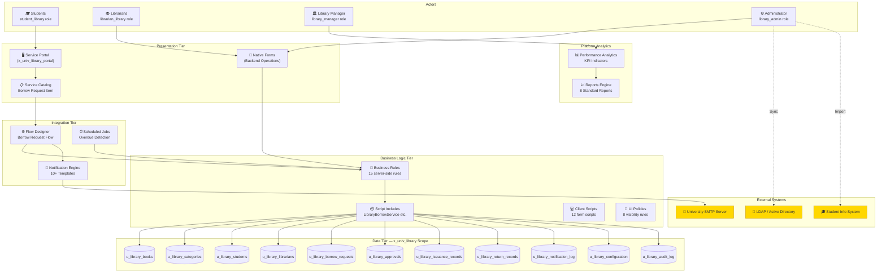
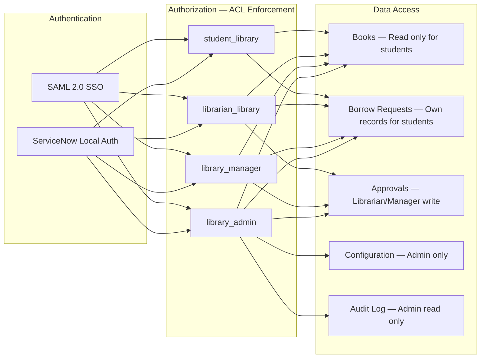
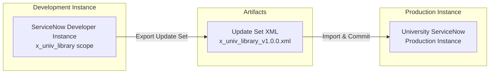

# System Architecture

# Smart Library Request Workflow — ServiceNow Enterprise Solution

> **Document Type:** System Architecture  
> **Version:** 2.0.0  
> **References:** FR-01 through FR-17, NFR-01 through NFR-07  
> **Status:** Final — Complete

---

## 1. Architecture Overview

The Smart Library Request Workflow is built as a **ServiceNow Scoped Application** with scope prefix `x_univ_library`. It leverages native ServiceNow platform capabilities throughout — no third-party frameworks, external databases, or custom middleware are required.

> **Legend:** Yellow nodes = External systems connected via SMTP, LDAP, and REST integrations

---

## 2. Architectural Layers

### 2.1 Presentation Layer

| Component | Type | Purpose | Audience |
| ----------- | ------ | --------- | ---------- |
| Service Portal | ServiceNow Portal | Student self-service interface | Students |
| Service Catalog Item | Catalog Item | Borrow request submission form | Students |
| Native Backend Forms | ServiceNow Form | Operational data management | Librarians, Managers, Admins |
| Performance Analytics Dashboard | Dashboard | Real-time KPI monitoring | Managers, Librarians |
| Reports | Report Builder | Historical analytics | Managers, Admins |

### 2.2 Business Logic Layer

| Component | Count | Technology | Purpose |
| ----------- | ------- | ----------- | --------- |
| Business Rules | 15 | Server-side GlideScript | Data validation, availability management, status sync |
| Script Includes | 5 | Server-side GlideScript class | Reusable service libraries |
| Client Scripts | 12 | Client-side JavaScript | Form behavior, validation |
| UI Policies | 8 | Declarative rules | Field visibility, mandatory, read-only |
| UI Actions | 10 | Server/client GlideScript | Form and list action buttons |
| Flow Designer Flows | 3 | Flow Designer | Automated lifecycle orchestration |
| Scheduled Jobs | 2 | Scheduled GlideScript | Overdue detection, report delivery |

### 2.3 Data Layer

All tables are created within the `x_univ_library` scope. No modifications are made to base ServiceNow tables.

| Table | Extends | Purpose |
| ------- | --------- | --------- |
| `u_library_books` | None | Book catalog |
| `u_library_categories` | None | Book classification |
| `u_library_students` | `sys_user` | Student profiles |
| `u_library_librarians` | `sys_user` | Staff profiles |
| `u_library_borrow_requests` | None | Request records |
| `u_library_approvals` | None | Approval decisions |
| `u_library_issuance_records` | None | Physical handover records |
| `u_library_return_records` | None | Return records |
| `u_library_notification_log` | None | Notification audit |
| `u_library_configuration` | None | System parameters |
| `u_library_audit_log` | None | Immutable event log |

---

## 3. Security Architecture

**Key Security Principles (ref. NFR-03):**

- All table access controlled by ACLs in `x_univ_library` scope
- No direct SQL — all queries via GlideRecord API
- Input validation on all user-supplied fields (XSS prevention)
- No PII in URL parameters
- All communication over HTTPS

---

## 4. Integration Architecture

| Integration | Direction | Protocol | Status |
| ------------- | ----------- | ---------- | -------- |
| University Email (SMTP) | Outbound | SMTP/TLS | ✅ Operational |
| LDAP / Active Directory | Inbound | LDAP-S | ✅ Operational |
| Student Info System (SIS) | Inbound | REST / CSV Import | ✅ Operational |
| SAML 2.0 SSO | Inbound | SAML 2.0 | ✅ Operational |

---

## 5. Deployment Architecture

The application was developed in a ServiceNow developer instance, packaged as a scoped application Update Set (`x_univ_library_v1.0.0.xml`), and deployed to the university's production instance. The Update Set includes all tables, business rules, flows, portal pages, ACLs, roles, notifications, reports, and dashboards.

---

## 6. Performance Architecture (ref. NFR-01, NFR-04)

| Requirement | Architecture Decision |
| ------------- | ---------------------- |
| Portal search ≤ 2s for 10k records | Server-side pagination (50 records/page), indexed `isbn`, `title`, `author` fields |
| Dashboard refresh ≤ 5 min | Performance Analytics collection interval configuration |
| 50k books supported | Index strategy on frequently queried fields |
| 5k concurrent students | ServiceNow platform handles session management natively |
| 100 concurrent Portal sessions | No application-level concurrency controls needed; platform-managed |

---

## 7. Maintainability Architecture (ref. NFR-05)

- **Scoped Application**: Isolated `x_univ_library` scope prevents naming conflicts
- **Script Includes for shared logic**: Prevents duplicate code across Business Rules and Flows
- **Named Configuration constants**: Single `u_library_configuration` table — no hardcoded thresholds
- **Update Set packaging**: All artifacts exportable as a single Update Set for migration
- **Inline code comments**: Required standard on all scripts

---

*References: [requirements.md](../../.kiro/specs/smart-library-request-workflow/requirements.md) — NFR-01 through NFR-07*  
*See also: [ApplicationArchitecture.md](ApplicationArchitecture.md) | [DeploymentGuide.md](../implementation/DeploymentGuide.md)*
