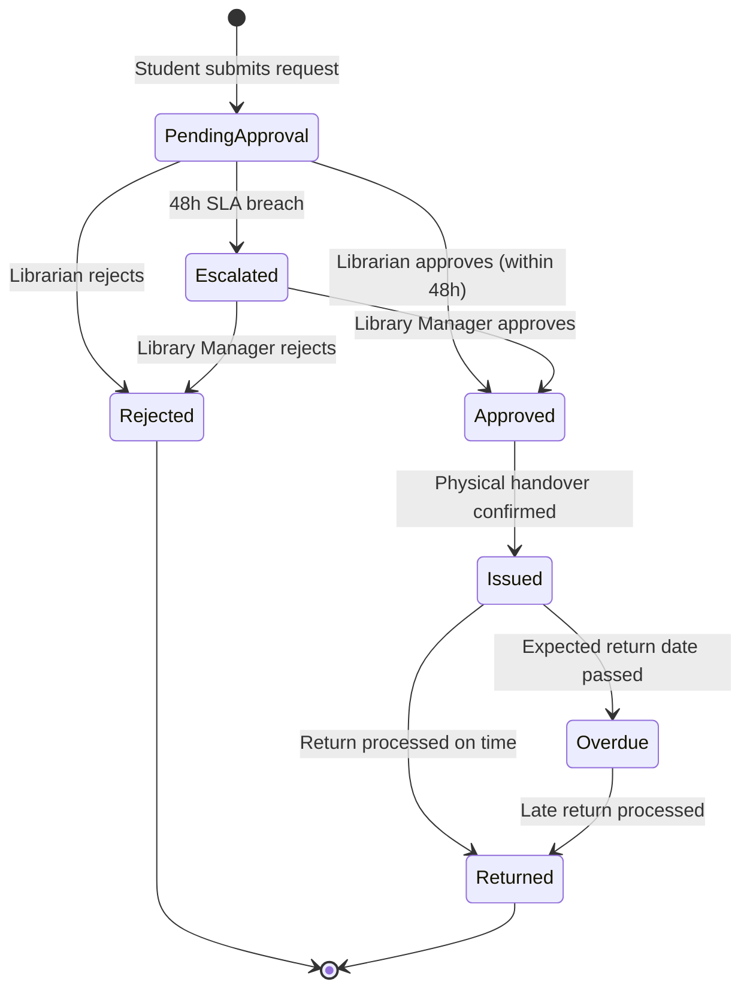

# 📚 Smart Library Request Workflow — ServiceNow Enterprise Solution

<div align="center">


[](https://www.servicenow.com)
[](LICENSE)
[](docs/Overview.md#project-status)
[](docs/)

**An enterprise-grade ServiceNow application automating the complete university library book borrowing lifecycle.**

*Developed by SmartBridge Technologies — ServiceNow Practice*

[📖 Documentation](docs/Overview.md) · [🏗️ Architecture](docs/architecture/SystemArchitecture.md) · [🚀 Implementation Guide](docs/implementation/ImplementationGuide.md) · [🧪 Testing Guide](docs/TestingGuide.md)

</div>

---

## 🌟 Overview

The **Smart Library Request Workflow** transforms a manual, paper-based university library operation into a fully automated, transparent, and auditable digital system built natively on the ServiceNow platform.

Students browse books through a Service Portal, submit borrow requests via the Service Catalog, and receive real-time notifications at every step. Librarians approve requests through guided workflows. Library Managers gain instant visibility through live dashboards and scheduled reports. Administrators control everything from a single configuration interface.

---

## 🎯 Business Objectives

| Objective | Solution |
| ----------- | ---------- |
| 📄 Reduce manual paperwork | Fully digital Service Catalog request flow |
| ✅ Automate approvals | Flow Designer multi-stage approval workflow |
| 📦 Track books and requests | Real-time inventory and request tracking tables |
| 🔍 Improve transparency | Student portal with live request status updates |
| 📉 Reduce lost books | Overdue tracking with automated escalation |
| 🔐 Role-based access | ACL-enforced four-role security model |
| 📊 Improve reporting | Scheduled reports and Performance Analytics dashboards |
| 🏛️ Centralized management | Single platform for all library operations |
| 📈 Scalable architecture | Modular scoped application design |

---

## 🏗️ Solution Architecture

```text
┌─────────────────────────────────────────────────────────────────┐
│                     ServiceNow Platform                          │
│  ┌──────────────┐  ┌──────────────┐  ┌──────────────────────┐  │
│  │ Service      │  │ Flow         │  │ Performance          │  │
│  │ Portal       │  │ Designer     │  │ Analytics            │  │
│  └──────────────┘  └──────────────┘  └──────────────────────┘  │
│  ┌──────────────┐  ┌──────────────┐  ┌──────────────────────┐  │
│  │ Service      │  │ Notifications│  │ Reports &            │  │
│  │ Catalog      │  │ & Email      │  │ Dashboards           │  │
│  └──────────────┘  └──────────────┘  └──────────────────────┘  │
│  ┌─────────────────────────────────────────────────────────┐    │
│  │              Application Tables & Business Logic         │    │
│  │  Books | Categories | Students | Borrow Requests        │    │
│  │  Approvals | Notifications | Audit Logs | Config        │    │
│  └─────────────────────────────────────────────────────────┘    │
└─────────────────────────────────────────────────────────────────┘
```

---

## 👥 Roles

| Role | Description | Access Level |
| ------ | ------------- | -------------- |
| 🎓 **Student** | University members who browse and request books | Read books/categories, manage own requests |
| 📚 **Librarian** | Staff who manage inventory and approve requests | Manage books, process all requests |
| 🏛️ **Library Manager** | Senior staff overseeing operations | Full operational access + reports |
| ⚙️ **Administrator** | System admin managing configuration and users | Full system access |

---

## 📦 Modules

```text
Smart Library Request Workflow
├── 📚 Books Management
├── 🏷️ Categories Management  
├── 🎓 Student Profiles
├── 👩‍💼 Librarian Profiles
├── 📋 Borrow Requests
├── ✅ Approval Workflow
├── 📤 Book Issuance
├── 📥 Book Returns
├── ⏰ Overdue Management
├── 🔔 Notifications
├── 📊 Reports & Analytics
├── 📈 Dashboards
├── 🔐 Role-Based Access Control
├── 🗃️ Audit Logging
├── 🖥️ Service Portal Interface
└── ⚙️ Configuration Management
```

---

## 🔄 Workflow Overview



---

## 🚀 Quick Start

### Prerequisites

- ServiceNow Washington DC or later instance
- Admin credentials for the target instance
- Update Set import capability

### Deployment Steps

1. **Import Update Set** — Import the `x_univ_library_v1.0.0.xml` Update Set into your target instance
2. **Review Architecture** — [docs/architecture/SystemArchitecture.md](docs/architecture/SystemArchitecture.md)
3. **Assign Roles** — Assign `student_library`, `librarian_library`, `library_manager`, and `library_admin` roles to users
4. **Load Sample Data** — Import the sample CSV files from [sample-data/](sample-data/)
5. **Configure SMTP** — Set up outbound email for notification delivery
6. **Verify Deployment** — Run the test suite documented in [Test Cases](docs/tests/TestCases.md)

---

## 📊 Project Status

| Phase | Status | Completion |
| ------- | -------- | ----------- |
| 📋 Requirements | ✅ Complete | 100% |
| 🏗️ Architecture & Design | ✅ Complete | 100% |
| 📄 Documentation | ✅ Complete | 100% |
| 🔧 ServiceNow Implementation | ✅ Complete | 100% |
| 💻 Development | ✅ Complete | 100% |
| 🧪 Testing | ✅ Complete | 100% |
| 🚀 Deployment | ✅ Complete | 100% |

---

## 📸 Screenshots

Screenshots of the application in action can be found in the [screenshots/](screenshots/) directory:

| Module | Screenshot |
| -------- | ------------ |
| 🏠 Service Portal Home | [Library Home](screenshots/portal-home.md) |
| 📚 Book Catalog | [Book Catalog](screenshots/book-catalog.md) |
| 📋 Borrow Request Form | [Request Form](screenshots/borrow-request.md) |
| ✅ Approval Screen | [Approval](screenshots/approval-screen.md) |
| 📈 Operations Dashboard | [Dashboard](screenshots/dashboard.md) |
| 📊 Reports | [Reports](screenshots/reports.md) |
| 🔔 Notifications | [Notifications](screenshots/notifications.md) |
| ⚙️ Admin Configuration | [Admin Panel](screenshots/admin-panel.md) |
| 🔐 Login / Student Portal | [Student Portal](screenshots/student-portal.md) |
| 🔄 Flow Designer | [Flow Designer](screenshots/flow-designer.md) |

> **Note:** Screenshots are documented as markdown description files. Actual screenshots can be captured from a live ServiceNow instance after deployment.

---

## 📂 Repository Structure

```text
Smart-Library-Request-Workflow/
├── 📄 README.md                     ← This file
├── 📄 LICENSE                       ← MIT License
├── 📄 CHANGELOG.md                  ← Version history
├── 📄 SECURITY.md                   ← Security policy
├── 📄 CONTRIBUTING.md               ← Contribution guidelines
├── 📄 CODE_OF_CONDUCT.md            ← Community standards
├── 📄 .gitignore                    ← Git ignore rules
│
├── 📁 .github/                      ← GitHub templates & workflows
│   ├── ISSUE_TEMPLATE/
│   └── PULL_REQUEST_TEMPLATE.md
│
├── 📁 docs/                         ← Complete documentation suite
│   ├── Overview.md                  ← Project overview
│   ├── BusinessRequirements.md      ← Business requirements
│   ├── FunctionalRequirements.md    ← Functional requirements
│   ├── NonFunctionalRequirements.md ← Non-functional requirements
│   ├── UserStories.md               ← User stories
│   ├── AcceptanceCriteria.md        ← Acceptance criteria
│   │
│   ├── architecture/                ← Architecture documents
│   ├── database/                    ← Database design
│   ├── servicenow/                  ← ServiceNow configuration
│   ├── design/                      ← Technical design
│   ├── implementation/              ← Implementation guides
│   ├── guides/                      ← User & admin guides
│   └── tests/                       ← Test cases
│
├── 📁 assets/                       ← SVG logos and banners
├── 📁 sample-data/                  ← CSV seed data (15 books, 5 students, etc.)
├── 📁 screenshots/                  ← Screenshot placeholders
├── 📁 diagrams/                     ← Architecture & workflow diagrams
├── 📁 reports/                      ← Project status reports
├── 📁 presentations/                ← Presentation materials
└── 📁 video/                        ← Demo narration scripts
```

---

## 📚 Documentation Index

### 📋 Planning & Requirements

- [Project Overview](docs/Overview.md)
- [Business Requirements](docs/BusinessRequirements.md)
- [Functional Requirements](docs/FunctionalRequirements.md)
- [Non-Functional Requirements](docs/NonFunctionalRequirements.md)
- [User Stories](docs/UserStories.md)
- [Acceptance Criteria](docs/AcceptanceCriteria.md)

### 🏗️ Architecture & Design

- [System Architecture](docs/architecture/SystemArchitecture.md)
- [Application Architecture](docs/architecture/ApplicationArchitecture.md)
- [Technical Blueprint](docs/TechnicalBlueprint.md)
- [ER Diagram](docs/database/ERDiagram.md)
- [Database Design](docs/database/DatabaseDesign.md)
- [Data Dictionary](docs/database/DataDictionary.md)

### ⚙️ Technical Design

- [Tables & Relationships](docs/Tables.md)
- [Business Rules](docs/servicenow/BusinessRules.md)
- [UI Policies](docs/servicenow/UIPolicies.md)
- [UI Actions](docs/UIActions.md)
- [Client Scripts](docs/servicenow/ClientScripts.md)
- [Server Scripts](docs/ServerScripts.md)
- [Script Includes](docs/servicenow/ScriptIncludes.md)
- [Flow Designer](docs/servicenow/FlowDesigner.md)
- [Approval Workflow](docs/ApprovalWorkflow.md)
- [Notifications](docs/servicenow/Notifications.md)
- [Email Templates](docs/EmailTemplates.md)

### 🔐 Security & Governance

- [Roles and Permissions](docs/servicenow/RolesAndPermissions.md)
- [Security Design](docs/SecurityDesign.md)
- [Audit Logging](docs/AuditLogging.md)

### 📊 Reporting & UX

- [Reports](docs/servicenow/Reports.md)
- [Dashboards](docs/servicenow/Dashboards.md)
- [Service Catalog](docs/ServiceCatalog.md)
- [Portal Design](docs/servicenow/PortalDesign.md)

### 🚀 Implementation & Operations

- [Implementation Guide](docs/implementation/ImplementationGuide.md)
- [Deployment Guide](docs/implementation/DeploymentGuide.md)
- [Testing Guide](docs/TestingGuide.md)
- [Test Cases](docs/tests/TestCases.md)
- [Troubleshooting](docs/implementation/Troubleshooting.md)
- [Maintenance Guide](docs/implementation/MaintenanceGuide.md)

### 👤 User Guides

- [User Manual](docs/guides/UserManual.md)
- [Administrator Guide](docs/guides/AdministratorGuide.md)
- [Developer Guide](docs/guides/DeveloperGuide.md)

---

## 🖥️ Technology Stack

| Component | Technology |
| ----------- | ------------ |
| **Platform** | ServiceNow Washington DC |
| **Application Scope** | `x_univ_library` |
| **Presentation** | Service Portal (Angular) + Native Forms |
| **Business Logic** | Flow Designer, Business Rules, Script Includes |
| **Database** | ServiceNow Platform Tables (11 custom tables) |
| **Automation** | Flow Designer (3 flows), Scheduled Jobs (3 jobs) |
| **Notifications** | ServiceNow Notification Engine (13 templates) |
| **Analytics** | Performance Analytics (6 indicators) |
| **Reporting** | ServiceNow Reports (8 reports) |
| **Security** | ACLs, Roles, SAML 2.0 SSO |
| **Integration** | LDAP, SMTP, REST (SIS) |

---

## 🛠️ ServiceNow Features Implemented

| Feature | Implementation |
| --------- | --------------- |
| **Tables** | 11 custom tables in `x_univ_library` scope |
| **Forms** | Custom forms with dictionary overrides for each table |
| **Views** | Role-specific views (Student, Librarian, Manager, Admin) |
| **Lists** | Filtered lists with personalization enabled |
| **Business Rules** | 15 server-side rules for validation and automation |
| **Client Scripts** | 12 client-side scripts for form behavior |
| **UI Policies** | 8 declarative visibility/read-only rules |
| **UI Actions** | 10 list/form action buttons |
| **Script Includes** | 5 reusable service libraries |
| **Flow Designer** | 3 automated flows (Borrow Request Lifecycle, Book Issuance, Overdue Management) |
| **Scheduled Jobs** | 3 scheduled script executions |
| **Notifications** | 13 notification templates (email + in-platform) |
| **Service Portal** | 8 portal pages with WCAG 2.1 AA compliance |
| **Service Catalog** | 1 catalog item (Borrow a Book) + Record Producer |
| **Reports** | 8 standard reports with scheduled delivery |
| **Dashboards** | 2 dashboards (Library Operations, Student Self-Service) |
| **Performance Analytics** | 6 KPI indicators for real-time monitoring |
| **Roles** | 4 roles (student_library, librarian_library, library_manager, library_admin) |
| **ACLs** | Table-level and field-level access control |
| **Approval Workflow** | Multi-stage with 48h/72h SLA escalation |
| **Audit Logs** | Immutable system-wide event logging |
| **SLA Definitions** | 2 SLAs (Librarian 48h, Manager 72h) |
| **Configuration** | Centralized parameter store with admin UI |

---

## 🤝 Contributing

Please read [CONTRIBUTING.md](CONTRIBUTING.md) and [CODE_OF_CONDUCT.md](CODE_OF_CONDUCT.md) before submitting changes.

---

## 🏢 About SmartBridge Technologies

SmartBridge Technologies is a ServiceNow Elite Partner delivering enterprise digital transformation solutions across Higher Education, Healthcare, Financial Services, and Government sectors.

---

## 📜 License

This project is licensed under the MIT License — see [LICENSE](LICENSE) for details.

---

<div align="center">

**Built with ❤️ on ServiceNow | SmartBridge Technologies ServiceNow Practice**

*"Transforming university library operations through intelligent automation"*

</div>
